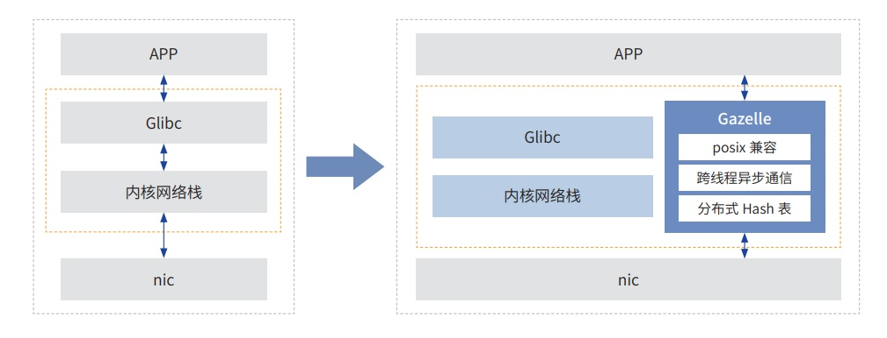

**应用背景**

上交所作为全球三大交易所之一，交易所交易系统是证券行业关键基础系统，其基于价格优先、时间优先的竞价原则
进行全市场的交易撮合。交易系统拥有更低的时延，更快的速度，可以大幅提升价格发现能力，带来交易便利性和市场获得感。
而当前交易系统所基于的操作系统内核协议栈在面临"大连接数 +
多线程"场景中存在明显短板，相比较而言用户态协议
栈较内核协议栈优势明显，可以提高应用的网络 I/O 吞吐能力。

**解决方案**

上交所正在研发的下一代核心交易系统为了在安全可控场景下提供更低的时延，当前基于鲲鹏服务器，通过
openEuler 低时延操作系统中用户态协议栈
Gazelle，在核心交易系统模拟场景下能够大幅降低节点间时延，技术在上交
所低时延技术实验室完成效果验证。

Gazelle 就是一款采用 Kernel by pass 技术的高性能用户态协议栈。它基于
DPDK 在用户态直接读写网卡报文，共享 大页内存传递报文，使用轻量级 LwIP
协议栈，在满足高性能、高可用的同时，具备良好的通用性和易用性。如图所示，
基于 GAZELLE 开发低时延交易应用，能够大幅提高应用的网络 I/O 吞吐能力。

**客户价值**

在网卡基础性能时延受到硬件限制的情况下，通过软件协议栈的优化，数据穿越网络协议栈的耗时降低
50%，在交易 系统实际订单交易测试中总体时延降低
10%，通过软件方案来弥补硬件的不足，提升了全栈产品的竞争力。
