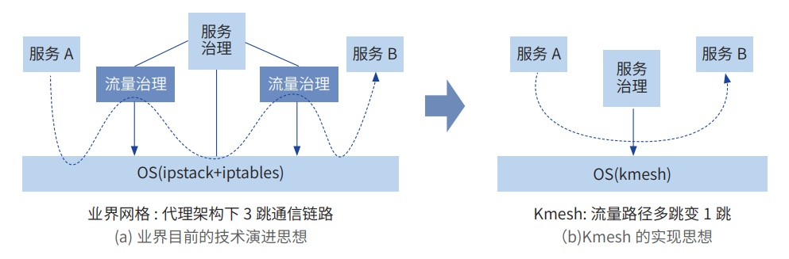

**应用背景**

随着应用场景的复杂和信息规模的爆炸式发展，现代软件逐步从传统的单体系统向分布式、微服务架构演进。在微服
务架构下，如何透明高效地实现服务互通（服务治理）一直是大家关注的重点问题。

金融行业业务复杂，时延性能要求高，各业务发展进程不一，存在业务的软件形态多样，底层通信设施复杂的问题；
通过服务网格架构将流量治理抽象成基础设施，可以很好的简化业务逻辑，将通信的复杂度从业务中解耦出来，但网格代
理架构引入的时延开销（单跳 2\~3MS），无法满足金融场景对时延性能的要求。

中信银行当前在基于服务网格架构做行内业务改造，面向未来 mesh
架构统一化，数据面性能面临挑战。

**解决方案**

Kmesh
是基于可编程内核实现的高性能服务网格数据面，具备高性能、低开销及安全可靠等特点；通过将
L4、L7 流 量治理能力卸载到内核，使得服务转发性能分别提升
50%、60%，底噪开销降低 70%。

Kmesh 当前支持的主要特性包括：

» 支持对接遵从 XDS 协议的网格控制面（如 ISTIOD）；

» 流量编排能力；

» 负载均衡：支持轮询等负载均衡策略；

» 路由：支持 L7 路由规则； »
灰度：支持按百分比灰度方式选择后端服务策略。

**客户价值**

基于 Kmesh 提升服务网格数据面性能，网联交易场景转发性能提升
40%，助力客户构筑金融级高性能服务网格架构， 树立行业标杆。
