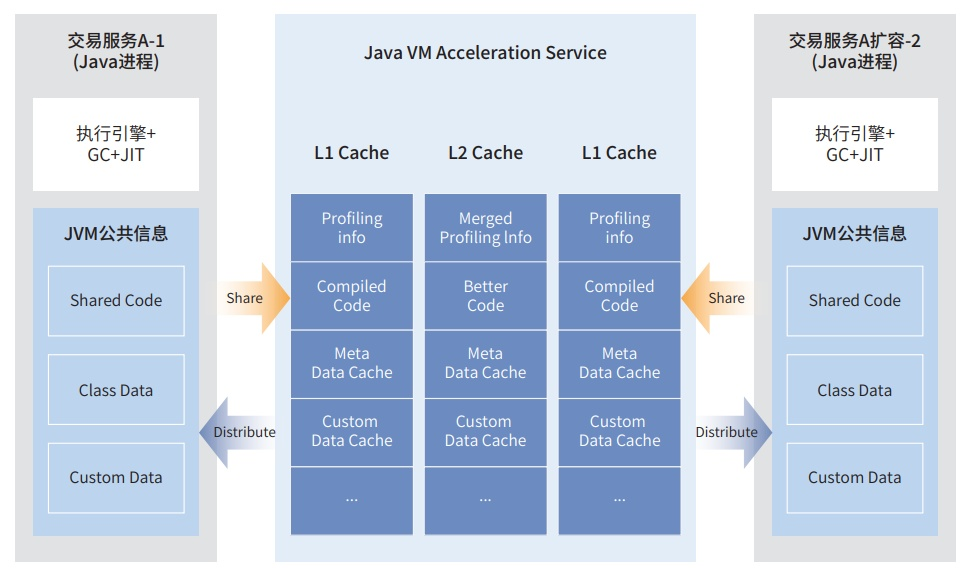

**应用背景**

恒生电子自研的核心交易系统 UF3.0
是新一代分布式架构的一站式金融经纪业务服务平台，面对每天亿级请求，具备
快速水平扩展、弹性资源等能力。微服务扩容后新增 java
实例因启动时间长，未充分预热等导致时延波动，是业界难题和 最大痛点。

**解决方案**

毕昇 JDK 结合恒生电子分布式微服务架构，新孵化 Jbooster 技术，引入一个
Java 服务端，负责收集管理同类交易 服务通用的框架类数据、JIT
代码信息等，缓存、汇聚并持续生成加速包，随后共享给新拉起的服务实例，使其启动和执
行加速，优化云原生业务性能。

**客户价值**

通过毕昇 JDK Jbooster 开启类加载器资源缓存、类数据共享、远程 AOT
编译等子特性并组合使能，恒生 UF3.0 产品 中 2 个 Spring
框架的具体业务启动速度均有显著提升，具体如下：

» 客户信息查询微服务从 53.92s 启动耗时降低到 42.22s；

» 公共组件中的任务调度服务从 37.09s 启动耗时降低到 20.95s。

整体启动加速提升 20%+，业务相比优化前提前 10s
以上预热完成，可快速应对扩容时海量的请求处理。
