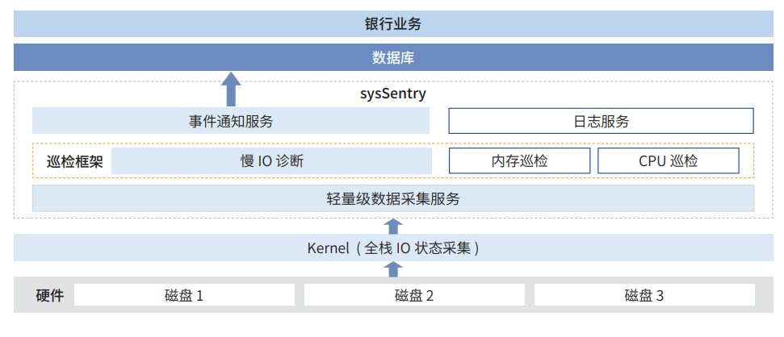

**应用背景**

数据库，作为银行核心系统的心脏，其稳定性直接关系到金融服务的连续性和客户的信任度。硬盘作为数据库运行的
物理基础，其健康状况对数据库的可用性有着决定性的影响。因此，提升操作系统对硬盘故障的慢
IO 感知和检测能力，是 确保数据库高可用性的关键。
在这一背景下，银行、数据库厂商和操作系统开发者的紧密合作显得尤为重要。通过基于
openEuler 的开放协作，共 同探索和构建高效的慢 IO
检测技术，可以实现端到端的协同，从而在硬盘故障发生时，快速响应，保障核心业务的连续运行。

**解决方案**

» Kernel：内核支持无锁磁盘 IO 跟踪能力以及基于 ebpf 的 IO
信息采集能力，采集 IO 栈各个阶段指标信息；

» sysSentry：openEuler 操作系统统一故障框里框架，提供轻量级数据采集、慢
IO 诊断以及秒级事件通知服务，快速感 知慢 IO 故障；

» 数据库等服务：通过接收操作系统上报的慢 IO
事件，快速感知故障并进行业务恢复，减少硬盘故障场景下的业务中断时间。

**客户价值**

» 高可靠：基于 openEuler 高效精准的慢 IO
检测技术，能够提供在金融场景下基于国产操作系统的高效硬盘故障感知
能力，提高数据库等业务的高效稳定运行，最快故障检测时间 6s，慢 IO
检测准确率 \>80%；

» 易运维：该检测技术能够提供内核 IO
全栈的信息采集以及异常检测能力，并记录异常数据，支持对于偶发性 IO
相关故障的快速定位定界。
