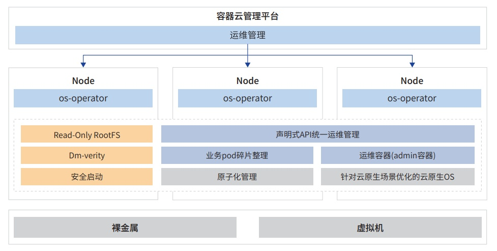

**应用背景**

24 年某行期望联合 openEuler 打造云原生操作系统，逐步改善云底座底噪 OS
资源消耗大、维护敏捷性不足、响应慢
等业务痛点问题，加速全栈创新提升竞争力。

**解决方案**

openEuler KubeOS
项目与某行共同围绕安全可控和灵活弹性目标打造不可变基础设施
OS，并对接行内云原生管理平 台，打通云原生 OS
和容器应用运维管理边界，提供云原生化的操作系统统一配置、管理和运维体验。

KubeOS 提供为云原生场景而设计、轻量安全的云原生操作系统和基于 kubernetes
的云原生操作系统统一运维解 决方案。KubeOS
针对云原生场景设计了轻量、安全的云原生操作系统，通过极简组件、根目录只读、dm-verity
等方 式，减少漏洞和攻击面，实现系统性能和安全性的大幅度提升。KubeOS 通过
kubernetes 原生声明式 API，统一对集群 worker 节点 OS
进行运维管理，减少运维过程中人工介入，降低云原生场景的运维难度和运维耗时。KubeOS
对接某行自 研容器云平台架构图如下:

**客户价值**

相比于现有云底座，提升 OS 启动性能 4 倍 +，减少 OS 资源消耗 4 倍
+，降低对云底座厂商的依赖。
