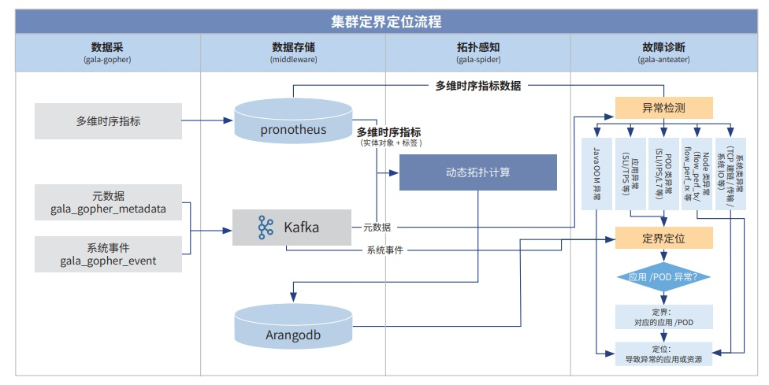

**应用背景**

在当前云原生技术加速发展以及微服务体系逐步完善的背景下，银行业的运维挑战日益复杂。某银行面临诸如资
源争用导致性能瓶颈、进程级异常难以快速定位、动态环境下的节点关联管理复杂等问题。针对这一现状，某银行联合
openEuler 启动了以应用为视角的可观测技术验证课题，旨在实现典型故障（如
TCP/IO 问题）的快速定界与定位，协同
行内现有的可观测工具体系，助力实现行内 1-5-10 的可观测运维目标。

**解决方案**

本方案通过与某银行的深度合作，构建了某银行全栈可观测技术体系，并协同华为软硬件一体化方案，着力实现于以"应
用视角"的全栈云一体化运维能力。此举有效解决从 IaaS 层到 PaaS
层的运维割裂问题，构建更为完整的观测和诊断链条。
围绕以下技术解决行内运维痛点：

**» 进程级异常追踪**：通过系统内存、CPU 指标观测技术，实现对特定进程所属
POD 实时观测分析，系统出现异常 文件时，能够对该进程对应 POD
实时异常检测与根因定位，明确进程对应的容器和应用，实现对异常进程的实
时监控，确保系统异常文件及时发现帮助完成快速定位定界；

**» POD 节点关联历史追溯**：通过无侵入 POD 指标采集，实现了 POD
历史状态变更信息实时记录，解决行内复杂动 态环境中故障发生导致的 POD
漂移与指标关联失效问题， 帮助实现精准的运维管理和问题复盘。

**客户价值**

通过与某银行的深度合作，在典型核心业务中进行试点，验证可观测技术的应用效果，并为未来的批量覆盖奠定基础。
这一方案有潜力大规模应用于银行内部的大部分业务，提升整体运维效率约 15%
。
