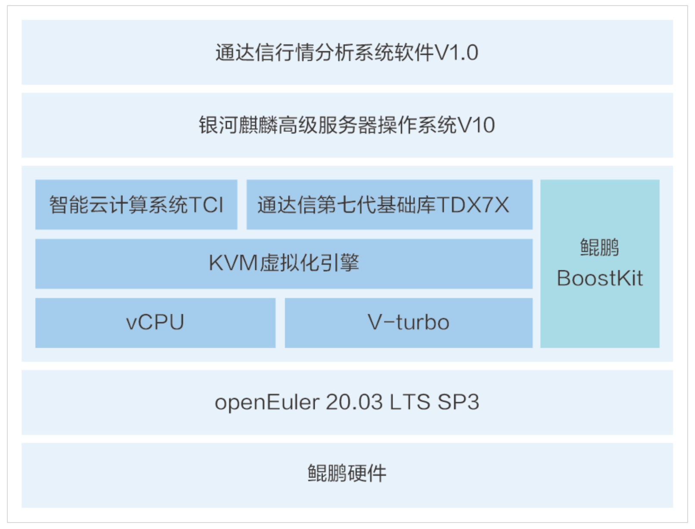

**应用场景**

金融市场的快速变化要求行情分析系统具备高性能和高可靠性。深圳市财富趋势科技股份有限公司的通达信行情分析系统，基于openEuler操作系统，为证券市场提供了一个全面、高效的行情分析解决方案。

**解决方案**

通达信行情分析系统的解决方案特点如下：

-   **openEuler操作系统**：系统后端运行在openEuler 20.03 LTS
    SP3上，针对鲲鹏处理器进行了深度优化，确保了高性能和高并发算力的发挥。

-   **行情数据服务**：提供沪深京行情数据清洗、计算、转发服务，确保数据的准确性和实时性。

-   **自主创新架构**：采用全自研技术架构，无第三方依赖，简化了部署过程，提高了系统的自主创新能力。

-   **分布式架构**：系统采用分布式架构设计，提高了系统的可用性和稳定性。

**客户价值**

-   **性能优化**：结合openEuler操作系统和鲲鹏架构，最大化地释放了鲲鹏算力，提升了系统性能。

-   **丰富的行情源**：支持国内外80个行情市场，提供丰富的L1/L2衍生数据品类，包括通达信加工后的股本变迁和基本财务数据。

-   **业务拓展性**：系统具备强大的业务水平拓展能力，能够在拓展新特性的同时保持向下兼容性。

-   **高可用性**：采用分布式架构，确保了系统的高可用性，减少了系统故障对业务的影响。

**应用**

该系统已经在申万宏源证券公司的行情系统程序中得到应用，证明了其在金融行情分析领域的实际效果和价值
