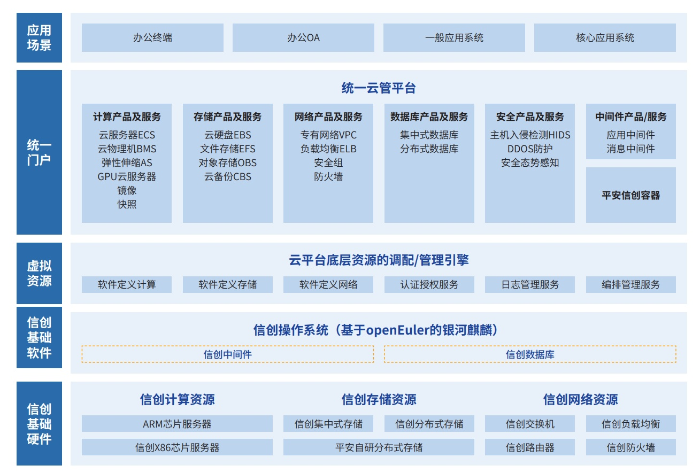

**应用背景**

随着金融 IT
基础架构及应用架构不断发展演进，不同架构下的大并发、高可用、敏捷交付需求，结合金融信息技术应
用创新的发展趋势，为支撑金融业务的可持续发展，本项目将信创与云计算的结合，结合金融行业实际，实现以信创芯片
服务器及操作系统为基座的云计算平台，支持利旧资源池及信创资源池架构的应用堆栈、数据中心资源统一监控和调度分配，
支撑金融业务信创迁移及建设需求。

**解决方案**

本项目从底层 IaaS 开始自主研发，兼容"ARM+ 信创
x86"混合资源池实现企业级"一云多芯 + 异构统管"，建设从传
统架构逐步过渡为信创混合架构的云计算平台。其中包括云管软件、虚拟化软件等云基础软件基于
openEuler 的银河麒麟研发， 并基于此对 PaaS
层应用实现全面化信创适配。本项目于 2021 年 1
月上线至今，实现云平台全栈信创化建设并逐步优化，支
撑了包括银行、保险、证券等金融全业务场景应用的信创改造建设。如下为架构方案图。

**客户价值**

-   实现新技术：从底层 IaaS 开始自主研发，兼容"ARM+ 信创
    x86"混合资源池企业级"一云多芯"，实现传统架构逐步
    过渡为信创混合架构的金融云计算平台；

-   孵化新方法：基于信创建设实践经验，建立信创基础软硬件选型引入成熟度模型及方法论，输出基于信创芯片和操作系
    统的云计算适配及迁移指南，并在金融全场景应用信创适配项目推进中，通过该指南及方法进行实际指导；

-   打造金融应用信创基座：支撑了包含办公、一般及核心金融业务场景约 300+
    金融业务系统完成信创改造。 本项目也因积极与 openEuler
    社区、产业及行业侧联创建设并深度优化，获得了由国家工业信息安全发展研究中心及
    openEuler 社区联合办法的 openEuler 领先商业实践奖。

**未来规划**

在项目建设过程中，主要的问题在于信创基础软硬件生态兼容性及生态拓展问题，如最新的服务器部件驱动无法支持、
部分部件在信创操作系统中无公版驱动，导致服务器无法正常交付等问题。在项目过程中也不断推动产业侧关联生态厂商之
间建立虚拟团队，面对金融行业侧实际问题时能够起到 1+1\>2 的合作共赢机制。
针对当前及未来的规划，将在当前实现信创云架构基础上，业务架构向云原生演进以满足金融业务场景高敏捷高弹性的
需求，建设信创云原生容器平台，快速满足金融敏态业务信创迁移及建设需求。
