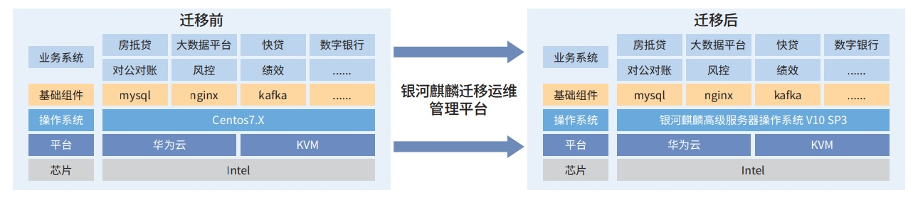

**应用背景**

2020 年，CentOS 社区宣布 CentOS 系列操作系统于 2024 年 6
月停止维护，所有使用 CentOS 的用户将无法获取官
方升级和补丁支持，可能导致用户业务系统面临服务中断、数据泄露的风险。按照国家部委相关文件精神，湖南农信需要
一款安全稳定的基于国内根社区开发的国产操作系统作为 CentOS 的替换方案。

**项目挑战**

对于非集群部署类业务，需要暂停业务系统进行操作系统的替换； »
业务系统与国产操作系统需进行大量的兼容性验证测试，一定程度增加了替换难度

**解决方案**

针对 CentOS 停服事件及湖南农信社业务需求，麒麟软件联合农信社制定了
CentOS 替换方案，并基于银河麒麟迁移运
维管理平台，结合湖南农信现有业务需求，协同研发了自动化迁移替换脚本，实现了自动化、批量
CentOS 操作系统的原机替换。 目前已完成 550 余套迁移替换工作，涉及辖内 40
多家农商行 87 个业务系统，迁移替换完后系统运行良好，无异常。

迁移方案图如下：

**客户价值**

-   针对 CentOS
    停服事件，形成了可推广的国产操作系统替换方案，避免停服事件带来的服务中断、数据泄露等风险；

-   提供了一种平滑无缝操作系统替换方案，能有效保障业务系统迁移后的稳定性、可靠性；

-   该方案具备自动化、批量迁移替换操作系统的能力，实现了迁移速度快、效率高、成本低的效果；
    » 实现了操作系统的全面受控，降低了基础软件供应链风险。
