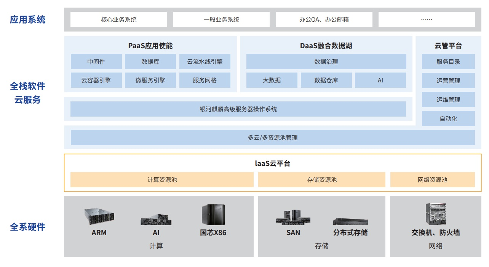

****

**应用背景**

随着近年来金融科技的快速发展，云计算平台逐渐成为金融行业数字化转型的核心驱动力。为构建数字化基础设施体系，
践行金融科技的创新发展，提供全资源、全服务，满足金融全业务场景需求，提升基础设施的运营运维能力，建设分布式
云平台，支撑新一代核心等项目的分布式架构转型。

**解决方案**

本项目基于"双栈并举、一栈多芯"的技术架构建设，提升安全自主可控能力同时加速推进金融领域科技能力国产化。
项目建设采用国芯 X86 和 ARM
平台双栈资源池，支持海光、鲲鹏硬件芯片；同时建设以 openEuler
的银河麒麟为基础，承
载国产数据库、中间件及应用系统运行的全栈信创软件基础设施，降低了对商业和封闭软硬件依赖，打造安全可控云技术生态。

**客户价值**

-   基础软硬件全栈信创：数字化基础设施体系的建设始终牢牢把握自主可控的根本，从基础网络、到云平台、到基础软件，
    再到上层应用系统的全面信创，为全面信创基础设置建设落地提供可行方案；

-   基础设施实现全面云化：坚持以"双栈并举、一栈多芯"架构，不仅双栈同等规划、建设、管理和发展，并且统一双
    栈能力，功能性能持平；统一多云管理，屏蔽业务对于双栈的技术差异；统一上云方案，支持业务系统跨栈无感部署，
    实现统一的网络访问和安全隔离。一栈多芯解决多元算力的兼容性和稳定性问题；

-   助力业务数字化上云：实现全栈云建设落地，支持生产、测试、研发全场景应用投产，为新一代核心、信用卡综合业
    务等重要系统信创及分布改造提供环境支撑。

**未来规划**

未来将加快应用系统上云进程，推进各系统容器化、微服务、分布式部署，满足金融业务场景高并发、高可用需求，促
进应用系统高质量上云，提供更加稳定、敏捷、优质的云上数字化服务。
