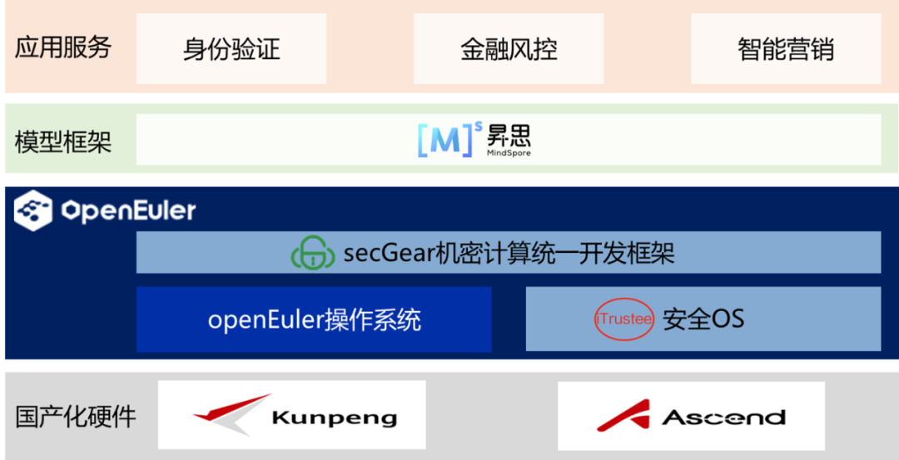

## 应用场景

随着《中华人民共和国网络安全法》、《中华人民共和国数据安全法》和《中华人民共和国个人信息保护法》的颁布实施和 AI 应用的迅猛发展，如何在 AI 服务的过程中保护数据和模型的机密性和完整性成为业务落地面临的关键挑战之一。作为长期推动数字化转型、持续关注 AI 技术在实际业务中的落地应用的国有大行，工商银行敏锐识别到了这一难题，在国家科技创新2023--“新一代人工智能”重大项目“数据安全与隐私保护下的机器学习技术”组织下，联合复旦大学、华为积极探索 AI 机密计算解决方案。产学研通力合作，基于鲲鹏、昇腾国产化硬件和 openEuler、iTrustee、 MindSpore 等国产化软件，共建数据安全和隐私保护增强的全栈自主 AI 云服务平台。

## 解决方案

-   硬件隔离环境：鲲鹏、昇腾都提供硬件可信执行环境（Trusted Execution Environment，TEE），保护使用中数据和代码的安全。

-   iTrustee：使能硬件安全可信执行环境。提供远程证明技术，用户可实时评估安全应用的可信性；提供机密容器技术，让应用迅速地迁移到机密环境中，低成本提升业务的安全性；提供异构安全通道技术，算力可安全卸载到 NPU。

-   secGear：机密计算统一开发框架，实现不同架构共源码，简化机密计算应用开发，提供端云安全通道，将端侧业务数据安全传入云端TEE中，并支持鲲鹏远程证明技术。

-   MindSpore：提供模型机密推理和异构后端调度能力，实现鲲鹏和昇腾异构算力的安全调度，防止用户机密数据上云推理时被云侧特权用户或攻击者窃取。

## 客户价值

-   全栈自主创新：基于国产化软、硬件，提供技术自主、供应链安全的国产化AI机密计算解决方案。

-   高安全：基于 openEuler 机密计算技术，增强现有 AI 业务系统的数据安全和隐私保护，在工商银行 e办公 APP 上线。

-   高性能：基于鲲鹏 TEE-昇腾TEE 的异构安全通道技术，算力安全卸载到昇腾 NPU，实现极致的安全和性能。

## 合作伙伴

