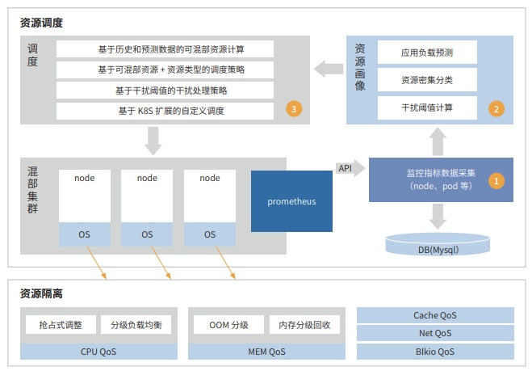
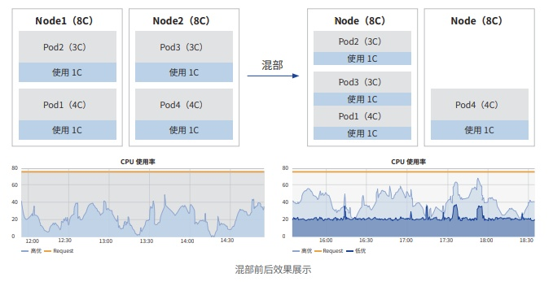

**应用背景**

随着"云计算第三次浪潮"到来，业界云计算体系布局正围绕"算力"出现结构性变化，云计算、大数据、人工智能
异构算力正在加速融合，推动实现算力更高效的调度利用。与业界相似，工商银行算力资源也主要投放在云计算、大数据、
人工智能三大技术领域，目前采用烟囱式架构建设，资源池整体算力资源利用率在金融同业已处于领先水平，但相较于业
界一流水平还有提升空间。

**解决方案**

工商银行基于云原生技术打造云数智一体化算力生态，同业首家构建了云平台的涵盖通用算力、大数据算力、人工智能
算力的"一云多算"新架构，具备业界领先的常态化资源混部、云原生智算基础设施、数字化算力运营等核心技术能力，项
目整体具备国内领先水平，曾获得人行高度评价。
其中，常态化资源混部是云数智一体化算力生态的核心技术能力。为提升生产资源利用率，工商银行结合业界混部方案，
实现基于行内场景资源混部技术，架构上从资源调度和资源隔离两个方面进行建设。资源调度方面，实现监控指标采集、资
源画像、混部调度三个核心功能；资源隔离方面，工行实现基于 openEuler
内核隔离技术，提供基于高低优先级的增强资源
隔离特性，解决混部场景下容器隔离性不足的问题。整体方案同业首家通过信通院"云原生混部技术能力评估"。

**客户价值**

云数智一体化算力生态建设打通工商银行各算力资源池的界限，实现算力的按需流动，全面提升算力的使用灵活性和使
用效率。一是通过在离线混部为业务部门提供额外算力，有效提升数据分析师、私人银行客户画像、客户画像核心标签等业
务场景时效，获得信用卡部等相关部门的好评，实现批量时效提升 20%
以上，混部资源池利用率达到 40% 以上，资源利用
水平达到业界领先水平。二是在保持较高资源利用率的情况下，系统可用性达到
99.9999% 以上，有效平衡"效率与稳定"
的矛盾，达到业界领先业务连续性水平。三是项目近 2 年累计挖潜物理服务器超
2800 台、GPU 卡超 400 块，节省成本超 3
亿元。实现了操作系统的全面受控，降低了基础软件供应链风险。

**未来规划**

未来，工商银行将深化云数智一体化算力生态建设，一是深化"一云多算"算力体系，建设"一云多算"算力调度系
统，全面统一通用、大数据、人工智能三类算力，各类异构算力在一朵云下统一调度，实现算力全面跨域流动。二是建设
Serverless AI 全托管平台，构建 Serverless AI 全托管平台，实现 AI
应用"快速启动、高效协同、灵活部署"的 Serverless GPU
资源调度模式，提高应用部署效率，减少 GPU 空闲时间，提升 GPU
资源的灵活性与可扩展性。三是深化数字化算力运
营能力，统筹云、大数据、人工智能算力，推动云运维走向数字化运营，实现更全盘的资源洞察、成本分析、资源挖潜等能力，
将云原生可观测能力全面赋能到跨界场景。
