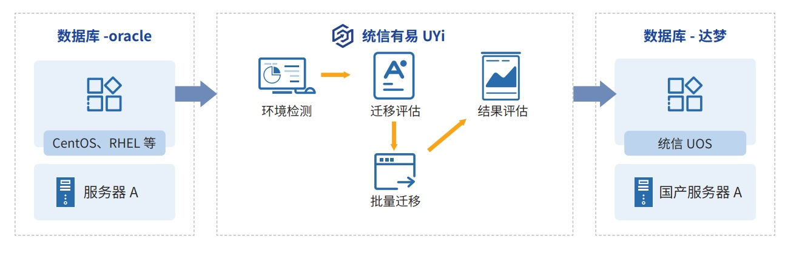

**应用背景**

贵州省农村信用社联合社（以下简称"贵州农信"）成立于 2003 年 12 月 30
日，是由省人民政府管理的地方金融机构，
是贵州省最大的金融机构。为保障基础软硬件供应链安全，贵州农信率先投入本土创新技术改造实践。此次改造系统为企
业网银平台，涉及底层平台，包括数据库服务器、操作系统和数据库软件。

**解决方案**

贵州农信"企业网银平台"是一个以平台服务群为载体的能力中心和资源中心，已形成业务开发、运营、营销、交付
等完整生态，目前有用户 13.6 万人，日均交易量 6.5 万笔，平均并发交易约 20
～ 30 笔 / 秒，日均处理逾 70 万条数据。
本次改造工作将"企业网银平台"的数据库服务器主机、操作系统、数据库软件整体更换为本土创新技术软硬件产品。
除了要对国外数据库和操作系统进行平行替换，对金融业务性能不能有下降并提出了性能优化需求，需要结合业务场景进
行针对性调优。同时迁移过程中需做到完善的金融数据备份方案

**客户价值**

通过对改造后的系统进行验证，各业务模块均通过了验证测试，系统运行高效、稳定，并为用户带来了以下价值和收益：

-   通过联合优化使业务查询和交易处理的性能均得到提升；

-   保障接口兼容性，使用户在使用体验等方面较之前无差异；

-   实现了关键核心系统软件供应链安全； »
    降低运维成本，核心系统生命维护周期得到有效延长和保障。
