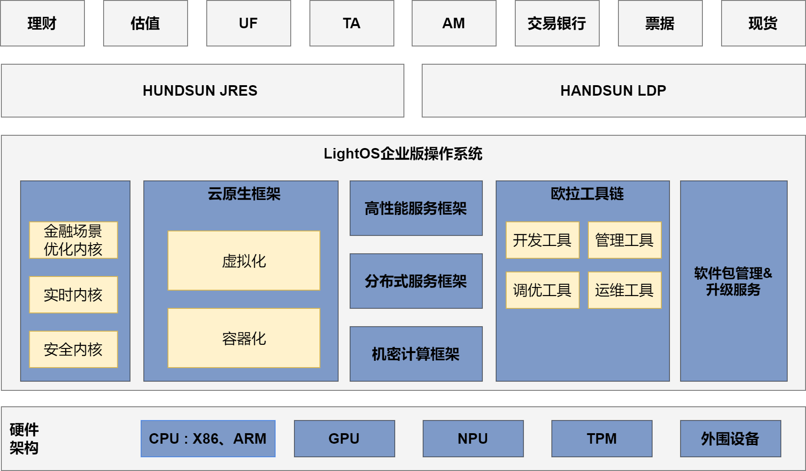

## 应用场景

恒生电子是一家以技术为核心竞争力，聚焦于财富资产管理领域，为证券、银行、基金、期货、信托、保险等金融机构提供整体的IT解决方案和服务的全领域金融IT服务商。

恒生电子基于开源openEuler22.03 LTS SP1进行金融证券场景深度定制开发的商业版本LightOS操作系统是为证券行业用户打造的国产化操作系统替代最佳实践解决方案，可以帮助证券用户一站式解决用户国产化替换中的系统稳定性痛点及业务性能痛点。

## 解决方案

LightOS解决方案针对证券交易场景进行深度裁剪，提升了系统部署效率、运维效率与安全性。针对恒生JRES、LDP两个底座平台进行了专门优化，使包括IAR网关、Redis、Kafka、低延迟消息总线等组件吞吐量大幅提高、延迟进一步降低；此外，针对证券国产化需求，对系统关键安全特性进行国密算法支持，为上层应用提供国密算法库、国密证书、国密安全传输协议等密码服务。

## 客户价值

- **功能与场景** ：LightOS结合恒生电子自身在金融、物联网等领域的丰富经验，并根据金融产品的落地场景与需求进行了深度裁剪与优化定制。针对金融行业面向低延迟、高并发、强安全的场景在系统组件层做了深度定制与调优。
- **性能与安全** ：LightOS操作系统特别针对恒生JRES平台及LDP平台进行了深度性能优化。总体性能提升超过10%。与传统操作系统相比操作系统更瘦身、组件方案更先进、并发性能更优化、业务交互更安全。
- **运维与支持** ：与润和软件合作提供系统常规支持、补丁升级、技术培训、开发支持以及现场交付等全生命周期的运维支持服务。

## 伙伴

江苏润和软件股份有限公司
