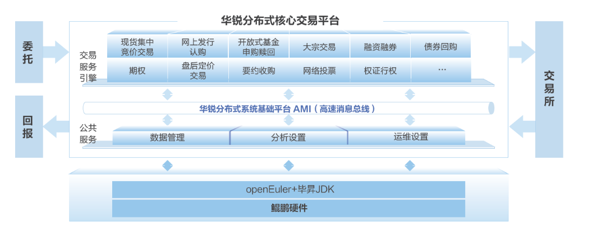

## 用户背景

华锐分布式技术实验室创立于2017年4月，是中国证券行业第一家专注于分布式低时延基础技术的研究机构。华锐主要面向新一代国产分布式金融核心系统，可为上层应用提供更高的性能、更低的时延、更高的可靠性和可用性。华锐在高性能计算领域具有丰富的经验，可对低时延场景进行针对性优化，让openEuler操作系统与业界领先的分布式低时延消息中间件AMI深度结合，达到自上而下整体性能最优，创造出最佳的业务效果。

## 方案介绍

华锐技术基于openEuler+鲲鹏底座推出证券核心交易平台ATP（Archforce Trading Platform），用于服务国内证券公司。它为券商连接证券交易所提供快速和完整的通道，具有高吞吐、低时延、松耦合、高可用、易扩展、接口易用、平台开放等特性，为投资者提供高品质的交易服务。 证券核心交易平台ATP使用鲲鹏应用使能套件BoostKit加速特性全面优化，同时使用openEuler+毕昇JDK提升性能，实现低时延、高可用的交易服务。

## 方案架构图

## 客户价值

-   使用openEuler+毕昇JDK提升性能，实现低时延、高可用的交易服务；

-   利用鲲鹏超低时延、超强算力、高吞吐传输的优势，处理上万笔订单，每笔仅需微秒级时延，有效提升存储以及各类加速器的性能，I/O总带宽提升66%；

-   满足证券、基金、期货公司、银行等机构的低时延高可用交易需求，打造自主创新的分布式核心交易平台，提升中国金融基础设施能力。

## 合作伙伴

