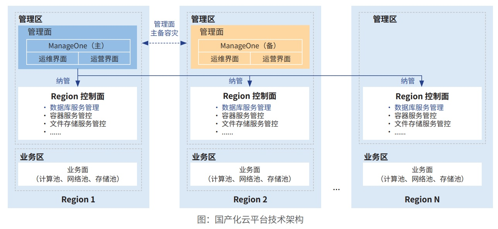

**应用背景**

近年来，农业银行不断加大金融科技研发力度，推动数字化转型进入深水区，全面建设以一体化云平台和分布式数据
库为关键基础的分布式架构体系，满足核心、关键业务对基础设施健壮性的要求，为分布式核心系统下移奠定基础，为全
集团应用系统提供虚拟化、容器、数据库、应用中间件等基础云服务。

**解决方案**

方案实现"银河麒麟 OS+ 云平台 +
分布式数据库"等基础设施的云化。一是采用基于 openEuler 的银河麒麟操作系统
替代存量老旧操作系统，满足存量硬件设备利旧使用要求。二是实现支持
ARM、海光 X86、Intel X86 等服务器的"一云多芯"
架构。三是麒麟操作系统适配各类基础软件，提供物理机、虚拟机、容器、分布式数据库、存算分离大数据等解决方案。

**客户价值**

一是基于银河麒麟 OS
搭建底层硬件和上层基础软件的桥梁，屏蔽了硬件差异。二是利用银河麒麟 OS
底层特性优化云
平台、数据库性能，满足金融应用高性能、高并发、高可用需求。三是建设三地六中心新技术栈资源池，快速落地云原生技术。
银河麒麟 OS 规模化推广，部署容器云节点 5000 余个，数据库节点 3000
余个，应用模块约 600 个。

**未来规划**

"银河麒麟 OS+ 云平台 +
分布式数据库"技术方案是农行基础设施架构演进方向。在后续的应用建设中，农业银行将持
续总结实施经验，沉淀平台能力，采用联创 +
自研的方式，完善银河麒麟操作系统的稳定健壮、数据安全、系统运维、研发
服务等能力，保障数字化转型建设，输出大行先进技术经验。
