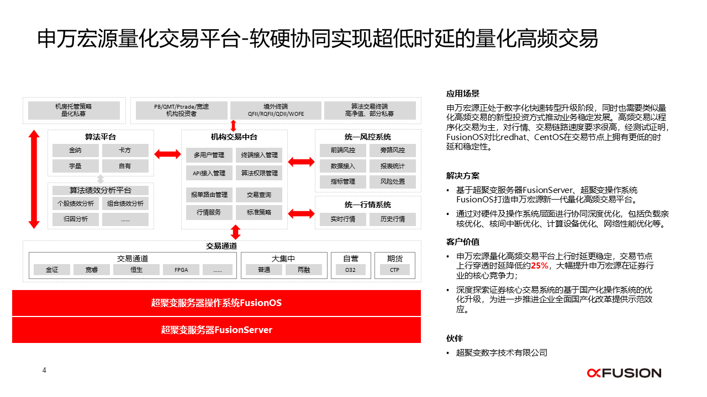

## 应用场景

申万宏源证券有限公司（简称“申万宏源”），是由新中国第一家股份制证券公司——申银万国证券股份有限公司与国内资本市场第一家上市证券公司。在申万宏源整体构建的“2349”数字化转型战略布局中，是以“交易+数据”为双轮驱动，三大能力建设（数字改造、平台构建、智能应用）为核心，四大基础支撑（基础设施、数据治理、体制机制及人才队伍、金融科技生态体系）为保障，借此进而希望改变现有的业务和收入结构，实现向机构综合服务方向转型目标。 

以申万宏源所处证券行业的高频量化交易为例，从客户策略托管机，到极速行情，极速交易，最终交易报盘。不仅包括程序化交易，还有行情、交易数据的传输、日内交易等，每个节点都对系统的极致时延、极致算力提出了全新的要求，即要求更智能的负载亲核设置、更深度的系统底噪优化、更灵活、智能的电源管理方案以及更低时延的网络通信解决方案。

同时，高频量化交易的特点是低时延、高频次、低隔夜持仓、高报撤单频率以及高换手率等，这对于竞争性时间压力、数据处理和分析方面也提出了更高的要求。

## 解决方案

超聚变操作系统助力申万宏源打造速度更快的高频量化交易平台

面对上述的问题，申万宏源经过不断探索和实践，联合超聚变实现科技赋能行业，助力其在高频量化交易上实现突破。而基于openEuler打造的超聚变服务器操作系统FusionOS也让申万宏源的业务发展路径真正产生“聚变”。 申万宏源携手超聚变和openEuler社区，针对如何实现更低时延的目标，对量化交易场景做了深入的洞察、分析和方案优化。

## 客户价值

FusionOS通过提供更智能的负载亲核设置、核间中断优化、计算设备优化、网络性能优化等一系列的软硬件深度协同调优手段，最终实现更稳的时延表现且交易节点平均穿透时延降低约25%，使能申万宏源在高频量化交易的核心竞争力提升方面取得了突破性的成就。
