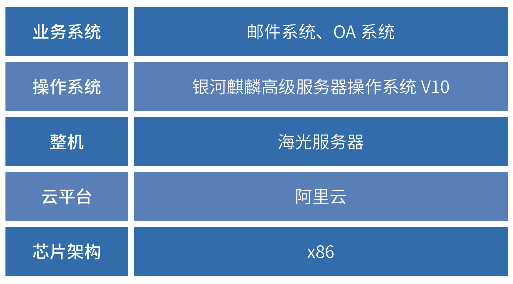

## 应用场景

随着“十四五”新基建及网络安全相关产业的布局与落实,金融行业数字化转型及高质量健康发展面临不同机遇和挑战。
在相关部门及权威机构的研究布局下,金融行业应用场景可划分为办公OA系统、金融机具应用、一般业务系统以及核心
业务系统四大类，阿里集团旗下天弘基金在项目规划中一期准备先进行OA及邮件改造。

## 解决方案

» 产品类型：银河麒麟服务器操作系统、

» 产品生态：阿里云

» 核心功能：
•支持多策略融合的访问控制机制»
 • 内核安全执行控制»KYSEC
 • 与阿里云兼容性强» »»»»»
 • 建设内容：以服务器操作系统配合完成邮件与OA的改造。

## 客户价值

 » 服务器系统安全保障：»麒麟服务器操作系统全面支撑起了行内改造国产化的业务系统。

 » 金融机具:»金融机具操作系统平滑替代了windows配合行内进行CRS等机具业务进行安全创新。

 ## 合作伙伴

