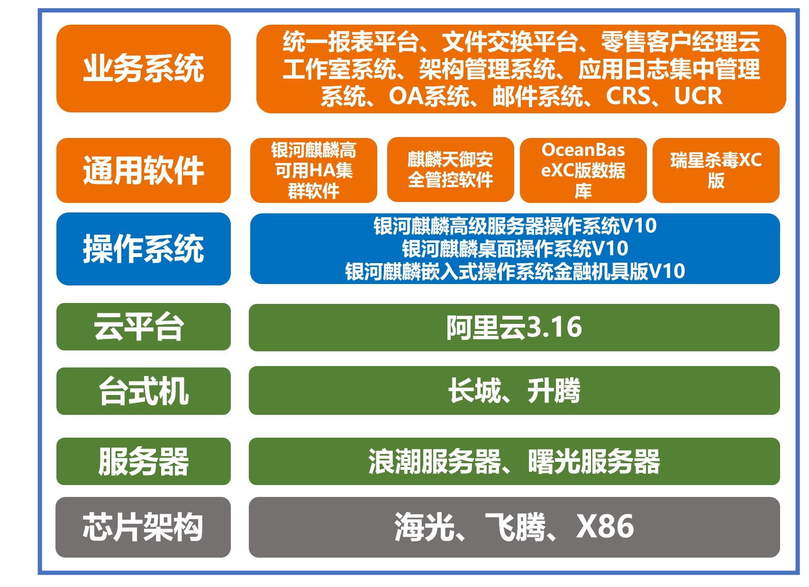

## 应用场景

2021 年天津银行制定了新的“十四五”IT 架构规划。在“十四五”期间，天津银行遵循国家“十四五”规划提出的加快数字经济发展、维护金融安全、构建双循环格局的指导要求，继承科技建设成果，筑牢 IT 基础设施，巩固安全防范体系，持续推进“2234”战略规划落地，打造数字化金融体系。致力于通过技术引领、数据引领、人才引领，全面提升该银行“安全、敏捷、快速、智能、自主创新”的科技能力，达到城商行领先水平。未来 3-5 年，天津银行将秉承十四五规划要求，稳步推进技术升级改造，提升自主创新能力。2023年，海鸥云开展创新区信息系统技术升级改造工作。

## 解决方案

- 配合天津银行海鸥云开展创新区信息系统技术升级改造工作。在业务系统底层选用银河麒麟操作系统，迭代升级当前部分业务系统使用的CentOS操作系统，为天行本年度海鸥云信息技术升级改造提供所需的操作系统运行环境。

- 整套业务系统选用银河麒麟高级服务器操作系统V10用于向下兼容阿里云、整机、芯片，向上配合行方科技人员进行核心业务系统的改造替换，兼容行方核心业务系统所需的中间件、数据库等重要组件，同时结合海鸥云平台实际情况对现有系统进行分析，制订升级改造策略。在改造前期针对行方“八核心”业务系统的改造进行性能测试。

- 最终银河麒麟高级服务器操作系统凭借“高安全、高性能、稳定性、兼容性自主可控”完美适用行方的需求，助力业务增长。

## 客户价值

- 高可用 + 服务器系统双安全保障：银河麒麟高级服务器操作系统 + 银河麒麟高可用集群软件全面保障了行内从 Windows 迁移到自主创新平台的可行性，并且在迁移后至今表现完美，无故障；

- 安全稳定高效：银河麒麟操作系统作为安全可信的自主操作系统，搭配麒麟天域安全域管平台，全方位保证安全办公与高效办公需求；

- 全场景迭代升级 : 银河麒麟高级服务器操作系统、银河麒麟桌面操作系统、银河麒麟金融机具操作系统全面配合行内进行安全创新。

## 合作伙伴

