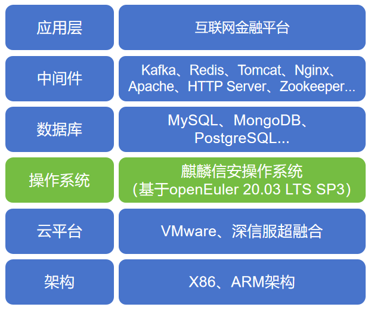

## 应用场景

湖南三湘银行股份有限公司（简称“三湘银行”）是中部地区首家、全国第八家开业的民营银行。三湘银行以“做一流的数智银行”为愿景，坚持“规模服从效益，效益服从风险，经营服从监管”的经营理念，坚持“数字化、在线化、自动化、智能化”的发展道路，将三湘银行打造成为科技驱动的银行，敢闯新路、敢于突破、敢于胜利的特色银行，一流的数智银行，接地气、受老百姓喜欢的银行，最具凝聚力的员工家园。三湘银行已建成各种特色金融系统服务实体经济，缓解产业链小微企业和普罗大众融资慢、融资难、融资贵的问题。

当前三湘银行已将业务系统全部迁移到x86架构的本地私有云平台（基于VMware虚拟化平台），存在大量业务系统运行在CentOS 7.6版本的操作系统上，部分业务系统运行在Redhat 6/7不同版本的商业发行版本上，极少量业务系统运行在Oracle Linux系统上。三湘银行急需一种安全、稳定、长期维护的基于国内根社区开发的国产操作系统版本。

## 二、业务挑战
1、海量数据处理

三湘银行业务系统涉及海量数据处理，包括客户信息、交易记录、贷款申请、风险评估等多方面的数据。为了高效处理这些海量数据，银行业务系统采用大数据技术和高性能计算平台，以确保数据的安全性、完整性和可靠性。同时，银行业务系统也需要具备强大的实时处理能力，以满足客户快速的交易需求，保障资金安全和交易稳定。因此，支撑海量数据处理的服务器操作系统是银行业务运营的重要基础，也是银行数字化转型的关键环节。

2、复杂的业务流程和系统集成

银行的业务流程通常是非常复杂的，包括开户、存款、贷款、结算、理财、投资、外汇交易等多个环节。这些业务流程需要涉及到多个系统，如客户关系管理系统、核心银行系统、风险管理系统、支付结算系统等。银行对不同系统进行集成，以实现不同系统之间的数据共享和业务协同。操作系统需要能够支持各种业务流程和系统集成，以实现多方面的业务需求和协同工作。

3、数据保护和隐私

为了保障银行业务系统的稳定和安全，防范各类风险，确保客户的个人信息和财务数据得到妥善保护。银行在数据保护和隐私方面对操作系统提出了高要求，包括数据加密和访问控制、安全漏洞防范、合规法规要求、审计和监控功能等方面的挑战。

## 解决方案

三湘银行经过不断的探索和实践，联合湖南本土操作系统厂家麒麟信安实现金融科技赋能，助力在自主创新上实现突破，基于国内openEuler社区打造的麒麟信安服务器操作系统让三湘银行的业务发展实现了质的变化，三湘银行携手麒麟信安和openEuler社区，对如何完成银行业务系统的自主创新、兼容适配、迁移替换等问题进行了深入的探索分析和方案优化。

- 基于麒麟信安服务器操作系统和国内外数据库、中间件打造互联网金融平台，与各云平台及容器云服务商深度适配，实现多云协同，可以为业务系统提供充分广泛的算力支撑与加速能力。

- 针对三湘银行的业务系统情况和系统运行环境，麒麟信安自研了一站式系统迁移平台C2K。C2K可以支持将三湘银行现有生产环境中部署的RedHat操作系统、CentOS 操作系统迁移至麒麟信安操作系统，满足原地升级迁移和适配迁移的迁移需求。

- 三湘银行对麒麟信安服务器操作系统提出了更高的安全标准，麒麟信安在多种内核安全方面进行增强和优化，尤其是结构化保护级安全内核和实体一体化的强制访问控制机制，结合openEuler社区的持续版本更新，麒麟信安对安全漏洞进行及时修复，增强了三湘银行业务系统的安全性。

## 客户价值

1.麒麟信安服务器操作系统在三湘银行业务系统的自主创新上可以有效降低了三湘银行特色金融服务的信息化投资，将国外系统平滑迁移为国产商业版操作系统，夯实了三湘银行IT信息化系统的安全底座，为金融行业自主创新推广提供了可借鉴的技术路线。

2.麒麟信安服务器操作系统对系统内核、进程调度、内存拷贝、网络通信、安全组件、集中运维等做了深度定制与性能调优，组件方案更先进、并发性能更优、业务交互更安全，并形成具有自主知识产权的增值产品：高可用集群管理系统、存储多路径系统、高可用冗余网络系统、集中运维系统等，为三湘银行提供低成本、高效率的基础软件自主创新升级改造方案，提升运维效率、促进平滑替换。

## 合作伙伴

