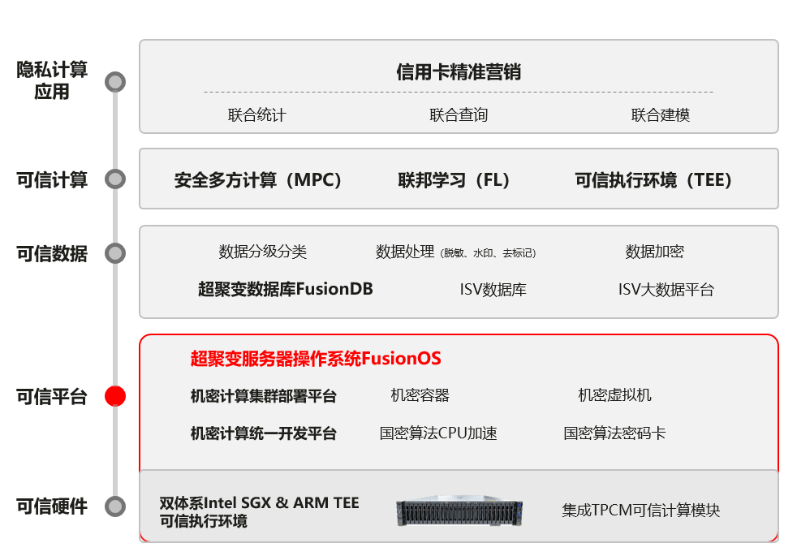

## 应用场景

兴业银行与超聚变数字技术有限公司、厦门大学携手，发挥产学研用一体化整体优势联合建设，厦门大学提供先进的算法模型及科研能力，超聚变提供产品解决方案及工程能力，兴业银行提供金融实践能力，三方发挥各自领域优势，强化基础研究与深度应用的高效转化，加速隐私计算与金融科技科研成果的商业应用进程，联合打造软、硬结合的全链路可信的隐私计算一体机方案，共同打造智慧金融隐私计算平台。

## 解决方案

-   提供涵盖超聚变操作系统 FusionOS、服务器 FusionServer、数据库 FusionDB 等软硬件的全链路可信解决方案；

-   基于机密计算技术，实现数据“可用不可见”，提供隐私保护的基础上，进行数据挖掘分析；

-   ARM 加解密核心，性能损耗低至 5%；国密/RSA 加速库，性能提升 35%；

-   FsionOS在基于SGX的英特尔安全云管理解决方案上 提供机密计算集群部署平台和应用统一开发平台，使能机密计算集群部署效率提升 50%，机密计算应用研发效率提升 90%。

## 客户价值

-   打造基于全链路可信的隐私计算平台，赋能兴业银行信用卡精准营销，使能兴业银行信用卡业务实现快速精准获新客、高效获新客以及高净值新客户的增长；

-   发卡成功率高达 90%，超过同类企业联合发卡的平均成功率，比网上进件发卡的平均成功率提升 44%；

-   同时基于更准确的用户画像，实现存量客户质量可实现大幅优化，优质客户占比明显提升。

