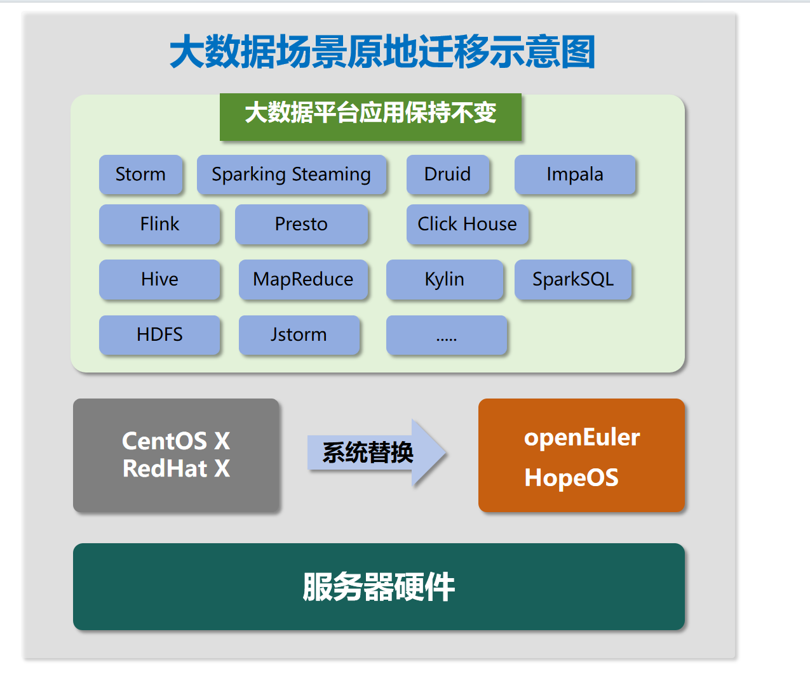
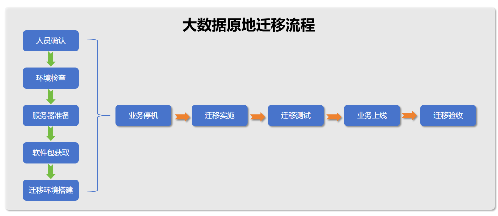

**业务平滑迁移，优化后性能提升10%左右**

**应用背景**

随着信息安全重要性日益凸显，阳光保险对现有平台改造，以提高信息安全性。为了确保业务的连续性和安全性，企业急需将原操作系统的业务应用迁移到openEuler操作系统上。在这种情况下，润和软件提供了基于现有操作系统的
HDP、CDH、FusionInsight HD
大数据原地迁移场景解决方案。在基础服务器硬件和上层应用不变的情况下，可以将大数据应用及数据库等组件平滑原地迁移到
openEuler/HopeOS
操作系统上，帮助企业轻松、顺利、高效地完成操作系统迁移，保障业务的持续运行和稳定性。

**解决方案**

**客户价值**

-   可以提高信息安全性，降低遭受外部攻击的风险，保护客户的数据和隐私安全。

-   降低对外部技术支持的依赖，提高系统的自主管理和控制能力。

-   将大数据平台顺利迁移至 openEuler
    系统，可以保障业务的持续运行和稳定性，避免迁移过程中出现业务中断或数据丢失等问题，且经过优化后性能提升10%左右。

**合作伙伴**

