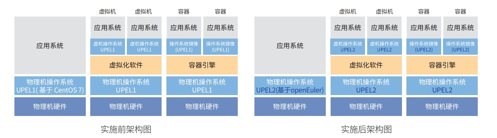

**应用背景**

UPEL 为银联内部 Linux 发行版，是 UP 产品栈中的重要组成部分，在 2017
年发布基于 CentOS 7 第一个版本，该版 本为 UPEL1。在 2020 年 CentOS
社区宣布停服，银联积极探索应对方案，采用基于 openEuler 研发 UPEL2
方案，并基 于 UPEL2
完成云管理平台、容器管理平台等基础平台适配，完成数据库、中间件等基础组件适配，并选取典型业务系统适
配，最终进行业务投产和不断推广。

**解决方案**

UPEL2 方案按照如下阶段实施： 验证阶段 : 进行 UPEL2
研发、选取数据库等典型基础软件，以及典型业务系统进行验证。基础平台适配阶段：完成云
管理等基础平台的适配，继续进行业务适配。投产和推广阶段：启动业务系统的投产和持续推广。
现处于推广阶段。新建系统直接采用
UPEL2；存量业务系统采用了新建资源迁移方案，最终单轨运行在 UPEL2 上。

**客户价值**

-   解决 CentOS 停服问题，提升操作系统安全性；

-   自主可控能力得到提升，积极融入开放性的开源社区，通过与社区专家交流学习能力得到提升；相关需求反馈社区，
    并得到社区及时响应，有效推动技术创新；

-   以社区为纽带增加与同行交流，操作系统适配、使用中问题及时反馈社区进行同行共享。提升了业务系统稳定性和安全性。

**未来规划**

随着芯片多样化、技术路线的多样性，操作系统迁移的成本不断增加。操作系统兼容性较难做到全面的评估，尤其是个
别的函数接口未变化但是行为发生变化的情况。随着 openEuler
生态体系不断完善目前可满足业务需求，但是部分产品仍然
需要长时间的打磨，以达到从"可用"到"好用"目标。希望未来加强同行加强交流、经验共享。
