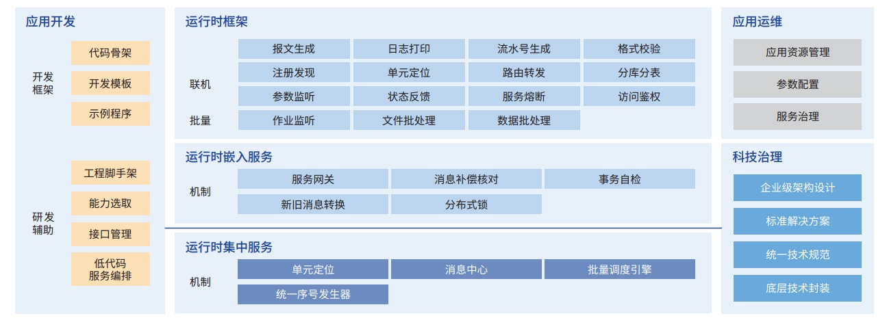

**应用背景**

随着互联网技术的快速发展，银行面临诸多挑战：一方面，银行业务呈现服务线上化、场景多样化、分析精准化、风
控实时化、需求响应敏捷化等特点，传统的 IT
架构难以满足业务要求，亟向更开放、更弹性、更包容的分布式架构转型。
另一方面，信创工程推进过程中，某些关键领域"卡脖子"问题突出，需持续强化核心科技自主研发能力。

**解决方案**

中国银行自主研发的分布式基础技术平台（以下简称"鸿鹄平台"），依托基于
openEuler 内核的麒麟商业发行版操作系统，
构建了安全可靠、稳定高效、自主可控的金融级软件基础底座。
平台提供了分布式架构下科技治理、运行时交易调度处理、分布式应用开发、分布式应用运维四大领域的技术能力。

**客户价值**

一方面，全面支撑业务发展。鸿鹄平台目前已支撑 12000 多个应用部署组、60000
多个应用服务实例稳定运行，技术执 行成功率达到
100%。其本身为上层的应用系统，提供了可支撑集团十亿级别客户访问、十万级
TPS（笔 / 秒）的业务交易 处理能力。
另一方面，赋能应用信创改造，降低改造的难度和工作量，提升了研发整体的质效。

**未来规划**

未来鸿鹄平台继续全力支持包括核心系统在内的应用系统的信创改造和架构转型。
一方面，现有功能按照信创需求和核心单元化架构进行适配改造；另一方面，新增仿真功能，通过"直播"、"录播"等方式，
全面验证新系统应用和数据库的功能和性能。同时，继续提升对容器等云原生技术的支持，为我行应用提供技术先进、功能完备、
运行平稳可靠的基础底座。
