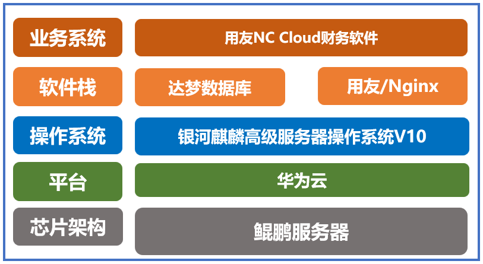

## 应用场景

浙商银行股份有限公司为浙江金融二期试点的股份制银行，为了响应国科技自立自强战略，加强银行信息化系统的安全性。针对单位原先使用的财务管理系统进行改造升级，集成用友 NC Cloud 财务软件、达梦数据库、用友稳件中间件等软件，完成全建设并成功上线，运行平稳、服务效率提升，对金融行业财务系统建设具有示范作用。

## 解决方案

-   服务器：虹信（鲲鹏）服务器

-   产品类型：麒麟服务器操作系统 V10+达梦数据库+用友中间件+用友 NC Cloud 财务软件

-   用户规模：10 套服务器操作系统

-   核心功能：对接业务系统、自动对账、动态配置、报表自动生成等功能

## 客户价值

在系统改造中，利用该解决方案进行功能升级，优化系统功能和用户体验，减轻工作人员负担，推动财务部门转型，促进账表一体化、业财融合等现代财务管理念在企业的落地，为企业改进财务管理办法、革新财务数字化体系提供范例。

