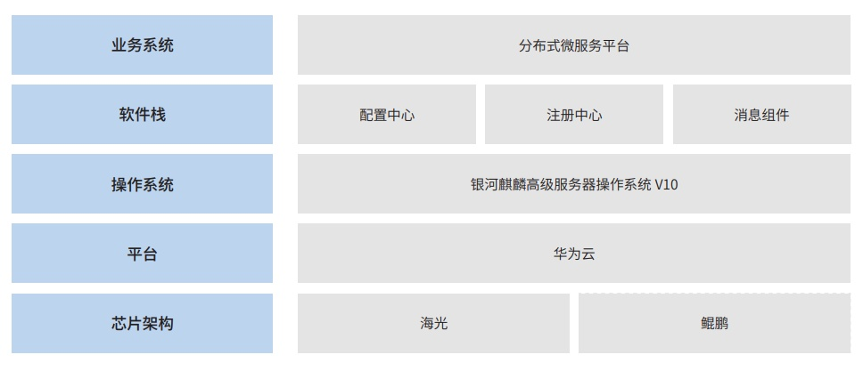

**应用背景**

浙商银行股份有限公司为浙江金融信创二期试点的股份制银行，为了响应国家信创科技自立自强战略，加强银行信息
化系统的安全性，对原分布式微服务平台进行改造升级，分布式微服务平台主要提供微服务开发框架、配置管理、服务治理、
日志与监控等功能，支撑全行海量业务服务运行。

**解决方案**

基于中科曙光（海光）服务器、清华同方（鲲鹏）服务器以及银河麒麟高级服务器操作系统
V10，对微服务注册中心、
配置中心、分布式消息组件、分布式锁、微服务网关等组件进行信创改造，上线后稳定支撑业务系统运行。

**客户价值**

通过分布式微服务平台信创改造，使系统满足了芯片、服务器、操作系统的国产化要求，实现了关键基础技术平台自主可控。
分布式微服务平台信创改造过程平滑，对上层业务系统无感知，改造完成上线后稳定运行，为上层业务系统提供高效、可靠、
自主可控的底层技术支撑。
