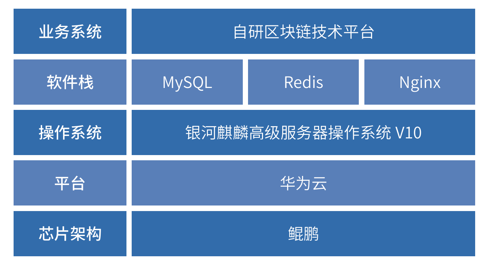

## 应用场景

浙商银行股份有限公司为浙江金融二期试点的股份制银行，为了响应国家科技自立自强战略，加强银行信息化系统的安全性。
对原区块链服务平台进行改造升级，区块链服务平台主要为客户提供区块链部署和数据上链存证服务，基于通用智能合约，
结合客户实际的区块链业务需求，客户通过接口接入区块待进行数据上链，数据查询验证，依靠区块链不可第改可追溯的
特性，进行重要金融数据存证。

## 解决方案

 » 服务器：清华同方（鲲鹏）

 » 产品类型：»麒麟服务器操作系统V10+MySQL+中间件
（Redis 和Nginx）+自研区块链技术平台；

 » 核心功能：对接行内资产通、极简报销、物联网等多个
平台，提供区块链基础务，进行重要金融数据的可信接
入与可信存证，实现金融级区块链服务能力的应用，助
力金融业务安全、高效运转。基于区块链服务平台，将
真实、实时的企业交易、经营动态、动产质押等数据上
链存证，构建“客观信用体系”

## 客户价值

» 通过本次业务升级改造，实现区块链服务平台对接行内资产通、极简报销、物联网等多个平台，对重要金融数据进行可
信接入和可信存证。使得金融机构能够掌握企业客户的真实生产交易、经营动态、动产抵押情况，而更加有效、准确、
及时的评估企业经营状况和风险，提升银行风险管控能力、降低险成本，帮助企业降负债、降成本、增效益，构建良好
的供应链产业链金融生态。

 » 区块链服务平台已通过国家工业信息安全发展研究中心的相关适配认证。

## 合作伙伴

