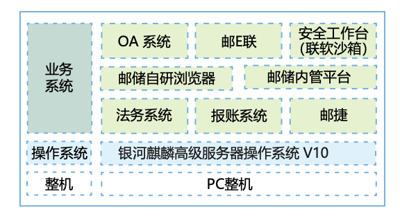

**应用背景**

邮储银行在创新架构业务系统建设中保持了极高的实施、迁移效率，自2023年下半年至今，已完成部署麒麟系统超4万套，涵盖业务系统160余个，不仅包括对公业务、个人业务、信用卡等核心业务系统，也广泛应用于综合办公、手机银行、大数据平台等关键业务系统，承载的用户规模约为8亿。其中openEuler系操作系统在现有业务系统的占比约为30%。

**解决方案**

-   统一异构资源池：银河麒麟V10作为核心基础底座，无缝整合了多个云平台与不同的CPU架构，形成了一个高度统一且灵活的异构资源池。

-   多服务架构体系：依托麒麟系统对主流云平台和CPU的广泛支持与优化能力，为银行核心业务系统及相关应用提供了多样化的服务架构体系。这些服务涵盖了分布式微服务、分布式中间件、大数据服务、高性能数据库以及高性能云存储服务等。

-   关键业务模块支撑：分布式核心云化部署方案有效支撑了公司存款、现金管理、银行汇款等公司核心业务系统关键模块的高效运行。

**客户价值**

邮储银行积极响应国家关于信息技术应用创新的号召，基于银河麒麟操作系统，全面推进关键核心技术自主创新、基础设施全面自主创新再实践和再发展。邮储银行作为国有大型商业银行，自觉履行高水平科技自立自强使命担当，为金融业关键业务系统实现自主创新提供了可行样本，为筑牢金融数智化安全防线奠定了坚实基础。

推广应用银河麒麟操作系统的过程中，邮储银行在平台建设、系统优化、运维管理等方面总结积累了丰富的实践经验，并联合厂商共同创新，持续优化改进部署、监控、运维方案。

**合作伙伴**

