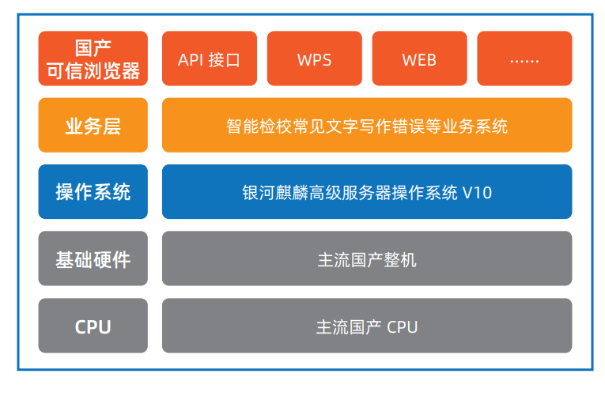

## 应用场景

新华社建立了覆盖全球的新闻信息采集网络，形成了多语种、多媒体、多层次渠道的新闻发布体系，不间断向全世界各类用户 提供多种形式的新闻和信息服务。为避免由于文章内容错误导致政府公信力受损的严重问题，麒麟软件联合新华社技术局，针 对公文内容校对核稿场景，推出基于银河麒麟操作系统的 AI 内容安全解决方案，建设新华较真内容安全，让校对工作更加准确 和高效。

## 解决方案
 

-	硬件：国内主流国内 CPU 及整机环境 
-	操作系统：银河麒麟高级服务器操作系统 V10
-	业务系统：智能检校常见文字写作错误等业务系统 
-	上层应用和接口：可信浏览器、API 接口、WPS、WEB 等应用

## 客户价值

标杆案例：“新华较真”作为一款来自头部主流新闻媒体的智能内容安全工具，充分发挥新华社的资源整合优势，自开始向 市场推广以来，已向中央部委、大型报业集团、国有企业、融媒体中心等数十家机构提供商业服务，并获得用户积极评价。 用户说“较真平台的推出，可以弥补人工校对中的失误，及时快速检测出差错内容”、“已经成为在编辑加工环节防止稿件 差错的有效助手”

## 伙伴

