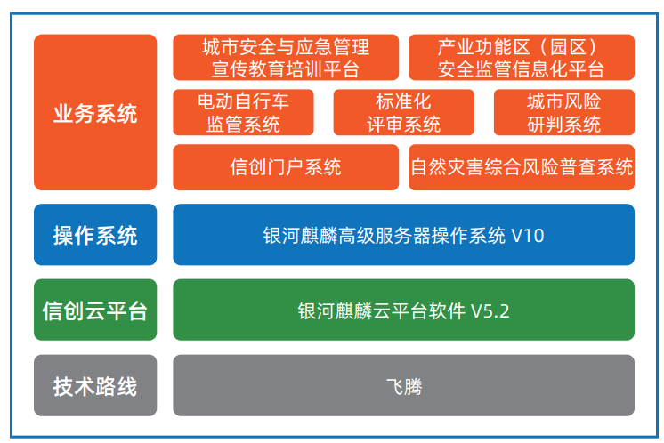

## 应用场景

成都城安院作为全国首家集“产”、“学”、“研”为一体的城市安全与应急管理研究院。在产业自主创新大趋势背景下，提前 融合新技术，布局网信产业，提高城安院的信息化自主创新能力是非常现实的需求。面对日益庞大的业务系统管理和运维需求， 城安院采用信创云作为全院系统，从底层达到自主创新的标准建设。

## 解决方案
 

-	服务器：飞腾 S2500 
-	产品类型：银河麒麟高级服务器操作系统 V10、 银河麒麟云平台软件 V5.2
-	业务系统：城安院核心生产系

## 客户价值

-	项目意义：省内第一个网信云项目，麒麟云做国内自主创新的云平台在技术上获得了客户认可，同时也为网信云平台制定 了技术规范。
-	规模化推广：验证了麒麟云在应急管理方面的生产业务场景下稳定运行，并可以快速实现规模化推广，同时为推广银河麒 麟云平台，以及网信云平台的推广积累了宝贵经验。

## 伙伴

