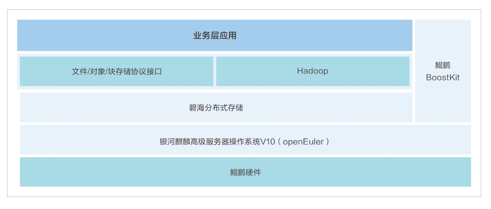

**应用场景**

上海霄云信息科技有限公司（以下简称"霄云科技"）专注于为数据密集型行业提供先进的数据存储解决方案。随着数据量的爆炸性增长，医疗、金融、电信等行业对存储系统的性能、可靠性和扩展性提出了更高的要求。

**解决方案**

霄云科技推出的碧海分布式存储系统，基于openEuler系操作系统构建，结合鲲鹏硬件和BoostKit应用使能套件，实现了以下核心优势：

-   **深度优化**:
    利用银河麒麟高级服务器操作系统V10(openEuler商业发行版操作系统)的特性，通过BoostKit进行深度优化，显著提升了存储性能。

-   **高性能**:
    碧海存储系统的IOPS性能达到国际开源软件和传统高端存储的2倍以上，确保了安全稳定的运行。

-   **灵活性和可扩展性**:
    根据业务需求灵活配置和扩展存储资源，软件支持轻松分配、管理和迁移存储资源，满足不断增长的存储需求。

-   **高可靠性**:
    采用多副本和强一致性策略，以及多层次数据修复机制，实现从磁盘级到机架级的全面容错。

> 

**客户价值**

1.  **性能显著提升**:
    碧海分布式存储在单线程文件存储读写性能提升70%以上，多线程性能提升约30%，为客户提供了快速、高效的数据访问体验。

2.  **业务支撑**:
    为医疗影像、医疗健康大数据、金融非结构化数据等关键领域提供了便捷高效的业务支撑。

3.  **易于管理**:
    通过软件定义的方式，简化了存储资源的分配和管理，提高了运维效率。

4.  **数据安全**:
    碧海存储系统的高可靠性设计，保障了数据的安全性和业务的连续性。

**结果**

霄云科技的碧海分布式存储解决方案已成功应用于上海市胸科医院、复旦大学附属肿瘤医院、华东医院、上海中医药大学附属龙华医院等多个医疗机构。这些案例证明了openEuler系操作系统在数据存储领域的强大应用潜力，以及霄云科技在提供高性能、高可靠性存储解决方案方面的专业能力。
