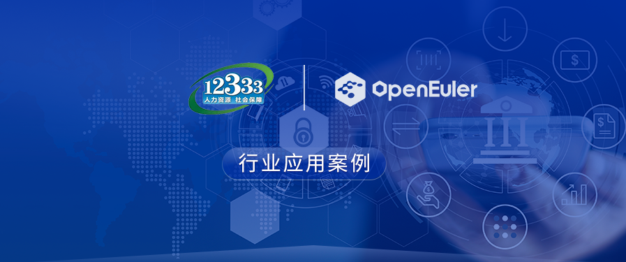
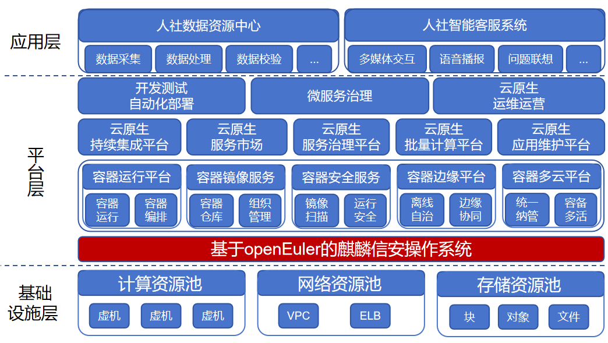

## 应用场景

长沙市就业与社保数据服务中心依托长沙市“政务云”的公共基础资源和相应的支撑能力，围绕社保、就业、人事人才、劳动关系等人社全量业务服务，力求建立以“智慧服务、智慧监管、智慧决策”为核心的“智慧人社”综合服务平台，实现人社领域数据共享、业务融合、管理提升和服务重构，形成“互联网＋人社”、“AI＋人社”新模式，推动部门间政务服务相互衔接，协同联动，打破信息孤岛，变“群众跑腿”为“信息跑路”，变“群众来回跑”为“部门协同办”，变被动服务为主动服务。

## 业务挑战

1、海量处理数据

前端业务数据访问量逐年增加，尤其是人社数据的采集、处理、智能客服等涉及大量的计算分析，海量查询和高并发对软硬件都是较大的挑战。

2、高安全性

业务数据通过网络进行高效的传递，但网络病毒和恶意访问导致系统容易面临入侵、数据丢失或篡改等问题，严重威胁到数据安全，亟需构建高安全、可信赖、全溯源的底层技术平台以有效预防安全漏洞。 

3、高可用

为了保证数据的高质量流通，让数据的采集、处理等过程无缝衔接，需要底层平台具备更高的性能，从而提高整体业务的运转效率。

4、兼容性问题

在软硬件适配方面，需要采用全栈自主创新方式部署，包括但不限于操作系统、浏览器、数据库、服务器、读卡器、打印机等软硬件设施，数据加密计算和用户密钥设计严格遵循国家商用密码保护体系。

5、集成问题

由于国产操作系统与其他软件和硬件设备的集成可能存在问题，可能需要进行额外的开发和集成工作，这将增加项目的复杂性和成本。

## 解决方案

方案架构图

长沙市就业与社保数据服务中心新建的服务器全部采用基于openEuler 20.03 LTS 为技术底座的商业发行版麒麟信安操作系统。

该系统具备高安全、高可靠、强实时、可定制等特性，与国内主要软硬件厂商共建生态体系，在安全性上该系统连续七次通过公安部四级测评，承担多项国家级重大专项任务，为国防、政务、能源、交通等领域提供行业级操作系统解决方案。

该系统不仅兼容达梦、高斯、MongDB、人大金仓等国内主流数据库，同时也很好的适配目前主流的国内外中间件，如：Apache Tomcat、TongWeb、Oracle Tuxedo等，通过从底层硬件到上层应用的软硬件逐步适配，顺利完成了业务系统的上线运行，提高了数据查询的响应速度，也支持亿级数据规模的快速存储和查询，支持7×24小时连续不间断的稳定运行，并保证了数据的一致性、完整性和准确性，满足大数据量的实际应用需要，为推进政务系统全栈式自主创新打下了夯实的技术基础，也有效应对了国外CentOS面临停服而无法提供长期技术服务的风险。

## 客户价值

- 将底层的CentOS替换为国内自主创新的麒麟信安操作系统，业务系统在安全性上得到了保障，解决了客户可能面临的数据丢失、系统瘫痪等痛点问题。

- 全面采用国内自主创新的软硬件设施，推动了政务系统向自主创新的演进，保障了国家的信息安全。

- 麒麟信安操作系统完美适配客户的软硬件设施，与存量操作系统混合组网，为客户建设人社数据资源中心和人社智能客服系统提供底层系统支撑，实现了客户的用户体系与长沙人社局各业务系统用户打通，形成统一的用户体系，实现了部门间政务服务相互衔接，全面提升长沙人社全业务办理和服务过程的信息化和智能化应用能力。

## 合作伙伴

