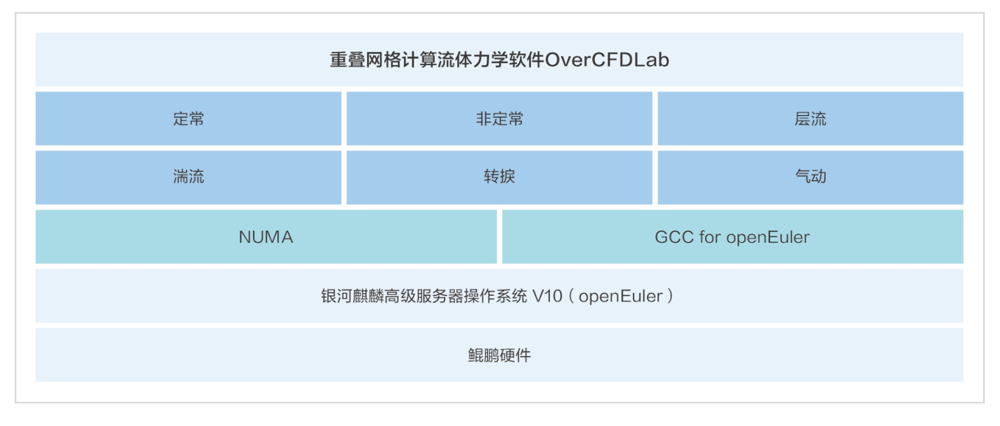

**应用场景**

在高端装备智能制造领域，CAE技术是关键技术之一，广泛应用于工业制造。西安前沿动力的OverCFDLab软件，基于openEuler系操作系统和GCC
for
openEuler编译器，为航空等行业提供了强大的计算流体力学（CFD）解决方案。

**解决方案**

OverCFDLab软件的解决方案亮点：

-   **openEuler系操作系统**：软件依托于openEuler系操作系统（银河麒麟高级服务器操作系统v10），利用其稳定性，为复杂的CFD计算提供了可靠的运行环境。

-   **GCC for openEuler编译器**：使用GCC for
    openEuler编译器进行代码编译，优化了软件的性能，确保了与鲲鹏硬件的高效协同。

-   **鲲鹏硬件适配**：软件针对鲲鹏硬件架构进行了适配，实现了在并行计算求解方面的效率提升，比传统计算平台提高10%\~20%。

**客户价值**

-   **计算精度与效率**：集成最新CFD算法，OverCFDLab在计算精度上与ANSYS-FLUENT相当，而计算效率则高出约3倍。

-   **大规模并行计算能力**：突破了商业软件的限制，支持亿级网格和万核CPU以上的大规模并行计算。

-   **技术创新与自主可控**：在高超声速气动热、复杂流场计算等方面，OverCFDLab打破了国外专业软件的禁运限制，支持国内工业制造的自主创新。

**客户应用**

该软件已经在航空等行业得到应用，并在实际乘用车行驶及复杂工况中展现出卓越的性能。
