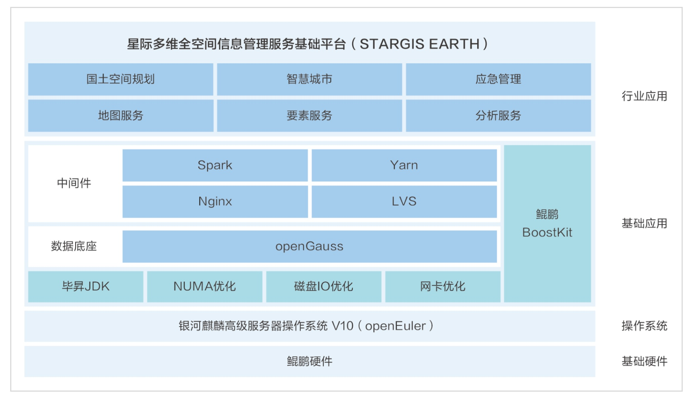

**应用场景**

星际空间（天津）科技发展有限公司（以下简称"星际空间"）致力于提供创新的地理信息服务，以支持城市规划、资源管理和环境监测等关键领域。随着地理信息系统（GIS）需求的不断增长，星际空间需要一个能够高效处理和分析多维空间数据的平台。

**解决方案**

星际空间开发的STARGIS
EARTH平台，基于银河麒麟高级服务器操作系统v10（openEuler商业发行版操作系统）构建，充分利用了其开源、稳定和安全的特性，结合BoostKit、毕昇JDK等技术，实现了以下核心优势：

-   **全栈性能调优**: 基于openEuler系操作系统和openGauss数据库，STARGIS
    EARTH平台进行了全栈性能调优，显著提升了三维和二维数据的加载渲染性能。

-   **多维空间信息整合**:
    平台具备强大的多维空间信息整合能力，能够高效管理和分析地理空间数据。

-   **高并发高吞吐量服务**:
    支持高并发和高吞吐量的空间数据服务，满足大规模数据处理需求。

-   **流畅加载渲染**:
    优化了大范围高精细模型的加载和渲染能力，提升了用户体验。

-   **空间体拓扑运算**:
    提供了先进的空间体拓扑运算能力，支持复杂的空间分析。

-   **地下空间建模**:
    具备地下空间实体语义化实时建模能力，扩展了平台的应用范围。

**客户价值**

1.  **性能提升**: STARGIS
    EARTH平台在三维数据加载渲染性能上提高了31.53%，在二维栅格数据加载渲染性能上提升了27.99%，显著加快了数据处理速度。

2.  **兼容性**:
    自主创新的平台兼容能力，确保了与国内主流环境的全面适配，包括多家CPU、操作系统和数据库。

3.  **数据处理能力**:
    平台的高并发和高吞吐量服务能力，满足了客户在大规模空间数据处理上的需求。

4.  **用户体验**:
    流畅的加载渲染能力和先进的空间分析工具，提升了最终用户的使用体验。

**应用**

星际空间的STARGIS
EARTH平台已经在天津市大数据中心、天津市规划和自然资源局、成都双流区规资局等多个重要项目中得到应用。这些成功案例证明了openEuler系操作系统在多维空间信息管理领域的强大应用潜力，在支持复杂空间数据处理和分析方面的优势，以及星际空间在提供高效、稳定、安全的地理信息服务方面的专业能力。
