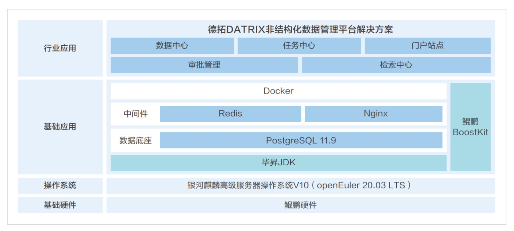

**应用场景**

上海德拓信息技术有限公司（以下简称"上海德拓"）面临的挑战是如何有效管理和激活日益增长的非结构化数据，以支持客户的数字化转型。在数据驱动的商业环境中，非结构化数据的管理和分析变得尤为重要。

**解决方案**

上海德拓开发的DATRIX非结构化数据管理平台，基于银河麒麟高级服务器操作系统V10(基于openEuler
20.03LTS版本的商业发行版)操作系统构建，结合鲲鹏硬件和毕昇JDK，实现了以下核心优势：

-   **高性能平台**:
    利用openEuler系操作系统和鲲鹏硬件的高性能特性，提升了平台的适应性和业务查询性能。

-   **并行查询优化**:
    采用PostgreSQL的并行查询优化配置，显著提升了数据库在高压力下的数据查询速度和业务并发性能。

-   **深度优化**:
    使用毕昇JDK后，平均查询时间缩短了11.75%，业务并发吞吐量TPS提升了2%。

> 

**客户价值**

1.  **性能提升**:
    通过PostgreSQL并行查询调优，系统查询时间缩短了28.57%，业务并发吞吐量TPS提升了16.2%。

2.  **数据资产统一管理**:
    平台围绕数据的核心流程，实现了从数据积累到数据治理再到数据应用的全过程统一管理。

3.  **深度洞察**:
    结合多种人工智能技术，深度挖掘文件内容信息，为客户提供更深入的数据洞察。

4.  **开放共享**:
    采用云原生和微服务框架，具有强大的兼容性、扩展性和开放性，支持第三方数据处理引擎和应用开发。

**应用**

上海德拓的DATRIX非结构化数据管理平台已经在多个行业成功应用，帮助客户激活非结构化数据的价值，加速数字化转型。
