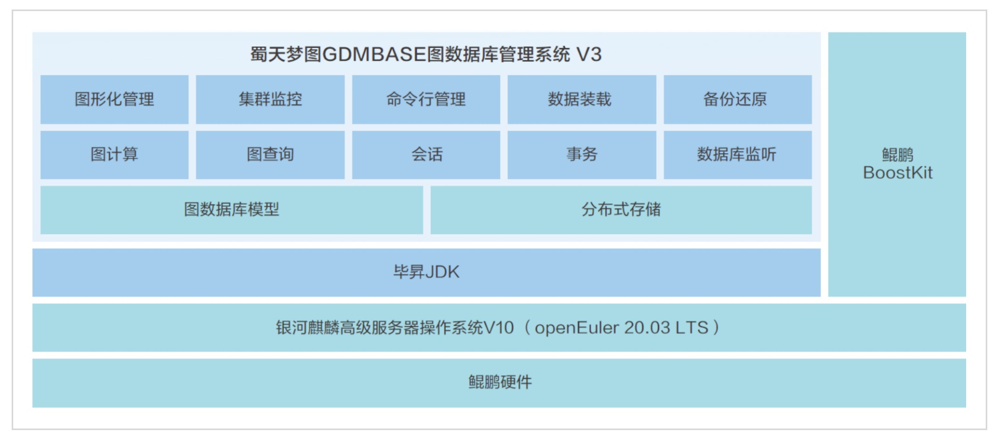

**应用场景**

四川蜀天梦图数据科技有限公司（以下简称"蜀天梦图"）致力于帮助企业实现数字化转型，通过图数据库管理系统提升决策效率，从经验驱动转向数字驱动。

**解决方案**

蜀天梦图推出的GDMBASE图数据库管理系统V3，基于银河麒麟高级服务器操作系统V10（openEuler
20.03LTS商业发行版操作系统）深度适配优化，结合鲲鹏硬件，实现了以下核心优势：

-   **全栈式优化**:
    利用openEuler系操作系统和鲲鹏硬件的高性能特性，提供了全栈式高可靠、高性能、高安全的图数据基础平台。

-   **性能显著提升**:
    深度适配优化后，计算分析能力综合提升了20%，磁盘读写性能提升了约15%，网络吞吐性能提升了5%。

-   **图数据库软件支撑**:
    GDM图数据库提供图存储、查询、计算等上层业务，实现了软硬件的高度兼容和高效协同。

**客户价值**

1.  **分布式架构**:
    支持存储节点的横向扩展，兼顾性能表现和存储占用，满足大数据时代的存储需求。

2.  **图计算能力**:
    提供多种图计算算法，支持联机分析和联机事务处理，显著提高了大图和超大图的分析计算能力。

3.  **图原生存储**:
    采用基于免索引邻接的图原生存储，优化了数据存储结构，提升了查询效率。

**应用**

蜀天梦图的GDMBASE图数据库管理系统已经在多个重要项目中得到应用，包括某省"公安云"图数据库应用、新网银行图数据库应用项目、某省监狱管理局大数据项目。这些案例证明了openEuler系操作系统在支持高性能图数据库管理系统方面的强大能力，以及蜀天梦图在提供高效、安全图数据处理解决方案方面的专业实力。
