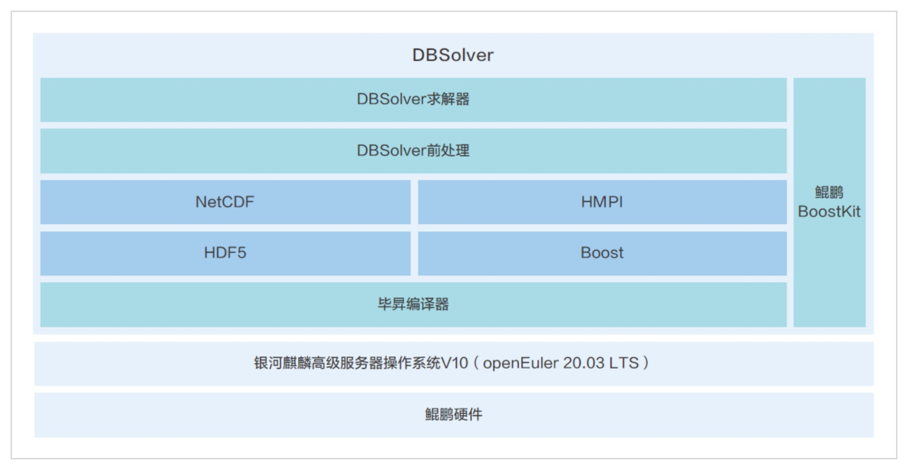

**应用场景**

西安数峰信息科技有限公司（以下简称"西安数峰"）专注于CFD（计算流体动力学）软件的自主研发，致力于为航空航天、核工业等关键工业领域提供高效、自主化的仿真软件解决方案。

**解决方案**

西安数峰开发的DBSolver仿真软件，基于银河麒麟高级服务器操作系统V10（openEuler
20.03LTS商业发行版操作系统）构建，并利用毕昇编译器和鲲鹏技术栈进行优化，实现了以下核心优势：

-   **自主化研发**:
    DBSolver软件采用C++面向对象分层设计，完全自主研发，推动了CAE行业的自主化进程。

-   **高效求解器**:
    基于openEuler系操作系统和鲲鹏技术栈的优化，DBSolver的求解器效率提高了20%，显著提升了仿真计算的性能。

-   **灵活的算法支持**:
    软件支持有限容积法（FVM）、有限元法（FEM）和格子玻尔兹曼法（LBM），为工业过程中的流动、传热传质、两相流等问题提供了强大的求解能力。

**客户价值**

1.  **自主可控**:
    软件的自主研发保证了技术的自主可控，减少了对外依赖，增强了国内工业软件的竞争力。

2.  **代码维护性**:
    软件代码结构清晰，易于阅读和维护，适合多人协作开发的大型项目。

3.  **应用广泛且精度高**:
    DBSolver仿真软件在多个工业领域得到应用，以其高精度和广泛的适用性获得了客户的认可。

**应用**

西安数峰的DBSolver仿真软件已经在西安交通大学、哈尔滨工程大学、中山大学、中航工业集团等多个教育机构和企业中得到成功应用。这些案例证明了openEuler系操作系统在支持高性能计算仿真软件方面的强大能力，以及西安数峰在提供专业、高效仿真软件解决方案方面的专业实力。
