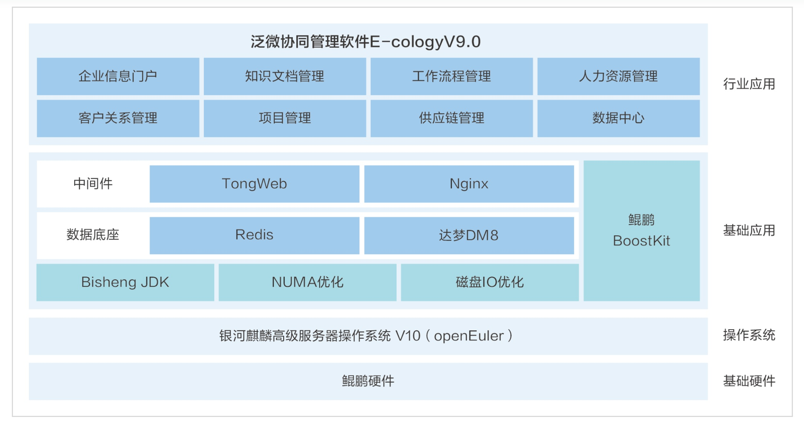

**应用场景**

在企业数字化转型过程中，协同管理软件成为提高工作效率、保障数据安全和推动业务创新的关键工具。泛微网络科技股份有限公司推出的E-cologyV9.0协同管理软件，基于openEuler系操作系统，为企业提供了一个全栈式自主创新的解决方案。

**解决方案**

泛微E-cologyV9.0协同管理软件的解决方案包括：

-   **全栈式自主创新**：软件基于银河麒麟高级服务器操作系统v10(openEuler商业发行版)，结合自主可控的硬件和软件生态，实现了从硬件到应用的全栈自主创新。

-   **性能优化**：利用openEuler系操作系统的高效性能和毕昇JDK、NUMA亲和性、磁盘io优化等鲲鹏BoostKit特性，软件性能平均提升25%以上，特别是在ec应用吞吐量上表现突出。

-   **公文管理**：提供集团统一的公文管理平台，支持多级组织的分层分级权限分发和管理，实现上下行文的高效对接。

-   **一站式督办跟踪**：实现了从督办事项发起到分析的PDCA全闭环管理，确保过程的透明性和可追溯性。

**客户价值**

-   **性能提升**：基于openEuler系操作系统的优化，显著提升了软件的运行效率和处理能力，为企业节约了时间和资源。

-   **数据安全**：openEuler系操作系统的安全性保障了企业数据的安全存储和传输，减少了数据泄露的风险。

-   **业务创新**：全栈式自主创新支持企业在数字化转型中快速响应市场变化，推动业务模式的创新。

-   **透明管理**：一站式督办跟踪系统提高了管理的透明度和效率，帮助企业实现更高效的决策和执行。

**应用**

这一解决方案已经在多家知名企业如中国大地财产保险、太平洋保险、中国人寿、浦发银行等得到应用，证明了其在提升企业运营效率和推动数字化转型中的重要作用，同时可以看到openEuler操作系统在支持企业级应用和促进企业创新中的卓越表现。
