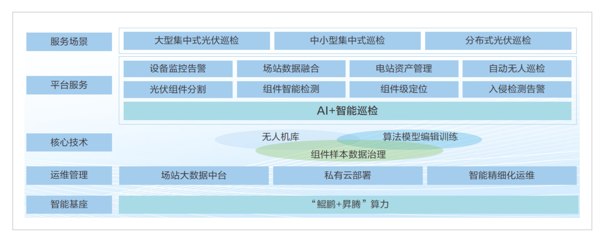

**应用场景**

西安因诺航空科技有限公司（以下简称"因诺科技"）致力于提升光伏电站的运维效率和安全性。面对光伏电站数据采集、故障诊断和运维决策等一系列挑战，因诺科技需要一个高效、智能的解决方案。

**解决方案**

因诺科技开发的光伏智能巡检平台，基于openEuler系操作系统和鲲鹏技术栈构建，实现了以下核心优势：

-   **SaaS模式**:
    平台采用SaaS模式，通过鲲鹏与昇腾算力支持，实现了全流程精细化管理。

-   **性能优化**:
    使用鲲鹏编译软件毕昇JDK、鲲鹏BoostKit、MySQL和调优工具，显著提升了软件运行性能。

-   **数据库优化**: 鲲鹏高性能开源软件MySQL
    8.0.20数据库结合BoostKit的优化策略，显著提升了数据库处理能力。

**客户价值**

1.  **性能显著提升**:
    基于鲲鹏BoostKit的MySQL性能提升达41.28%，服务器性能提升44.5%，极大提升了用户体验。

2.  **智能巡检**:
    实现了一键式任务巡检、无人值守、支持计划任务和临时任务巡检模式，自动生成巡检报告。

3.  **运维成本降低**:
    在确保电站安全生产的前提下，大幅提升巡检效率，降低运维成本，提高发电量。

**应用**

因诺科技的光伏智能巡检平台已在大唐国际------沧州海兴电站无人机项目、
大唐集团湖南------大唐向阳5G+无人机智能巡检及沧州海兴光伏巡检与安生系统开发、
国电投------基于激光点云数据化应用的智能巡检一体化管控平台研究与应用项目、
中华电力------光伏巡检智能分析无人机红外巡检系统等多个项目得到应用。
