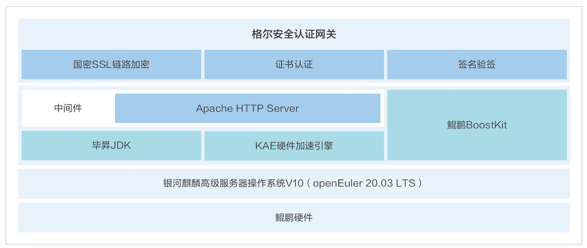

**应用场景**

在数字化时代，网络安全和数据保护成为企业和组织关注的焦点。格尔软件股份有限公司推出的基于openEuler系操作系统的安全认证网关，为实现网络环境的安全性和合规性提供了有力支持。

**解决方案**

格尔安全认证网关的解决方案特点如下：

-   **全栈调优**：利用银河麒麟高级服务器操作系统v10（openEuler操作系统商业发行版)的高性能特性，结合鲲鹏应用使能套件BoostKit，对网关进行全面的性能优化。

-   **国密SSL链路加密**：提供基于国家商用密码算法的SSL链路加密功能，确保数据传输的安全性。

-   **证书认证与签名验签**：实现证书认证和签名验签功能，保障用户身份的真实性、数据的机密性和完整性，以及操作的不可否认性。

-   **性能提升**：基于毕昇JDK和KAE硬件加速引擎，网关的整体性能提升了175%，显著提高了签名验签和数据加解密的性能。

**客户价值**

-   **安全性增强**：通过国密算法的应用，增强了网络通信的安全性，满足了密码测评和等保测评的需求。

-   **性能优化**：openEuler系操作系统与鲲鹏硬件的结合，提供了卓越的性能，使得格尔安全认证网关能够高效处理大量数据。

-   **合规性保障**：满足了国家对网络安全的合规要求，帮助企业构建符合法规要求的安全网络环境。

-   **硬件加速**：KAE硬件加速引擎的使用，进一步提升了网关的处理速度和响应能力。

**应用**

格尔安全认证网关通过结合openEuler系操作系统的优势，为用户提供了一个安全、高效、合规的网络安全解决方案。该网关已经在多个项目中得到应用，如某集团园区网的零信任项目和某证券国密改造项目，证明了其在保障网络安全和提升数据保护能力方面的实际效果。
