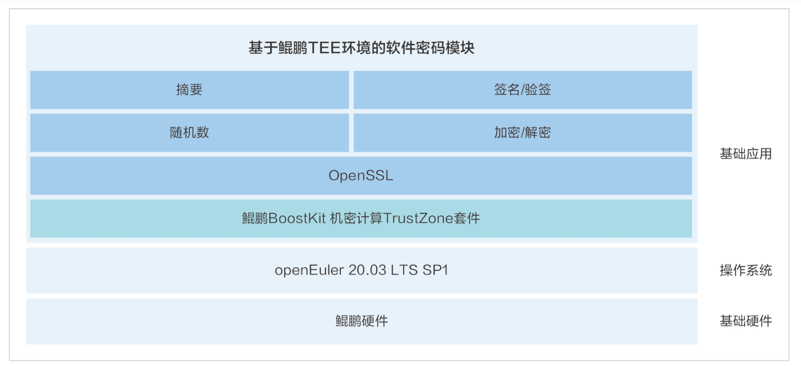

**应用场景**

在数字化时代，数据安全和隐私保护变得尤为重要。长春吉大正元信息技术股份有限公司推出的基于鲲鹏TEE环境的软件密码模块，利用openEuler操作系统，为服务器提供了一个轻量化、低成本、高可靠、高性能、低延时的密码服务支撑。

**解决方案**

该方案的核心技术和组件包括：

-   **openEuler操作系统**：作为系统底层，openEuler提供了稳定和安全的运行环境，支持TEE可信执行环境的高效运作。

-   **鲲鹏TEE环境**：通过与鲲鹏硬件内置的TEE环境对接，实现基于硬件设备的密钥生成、运算和存储，确保了密钥生命周期和运算过程的安全。

-   **软件密码模块**：与硬件TEE结合，提供非协同模式的密码服务，简化了服务流程，提高了效率。

**客户价值**

-   **性能提升**：结合硬件TEE和软件密码模块，服务器的密码服务性能是协同模式的207.56%，显著提升了处理速度。

-   **安全性增强**：基于硬件设备的密钥管理确保了密钥生命周期的安全性，减少了安全风险。

-   **成本效益**：提供了轻量化和低成本的密码服务解决方案，帮助企业在保障安全的同时优化成本。

-   **本地化服务**：本地化的密码服务减少了对外部依赖，降低了延时，提高了服务的响应速度。

**应用**

该方案已经在省级政务云密码服务平台建设项目中得到应用，证明了其在提升数据安全和优化服务性能方面的实际效果。
