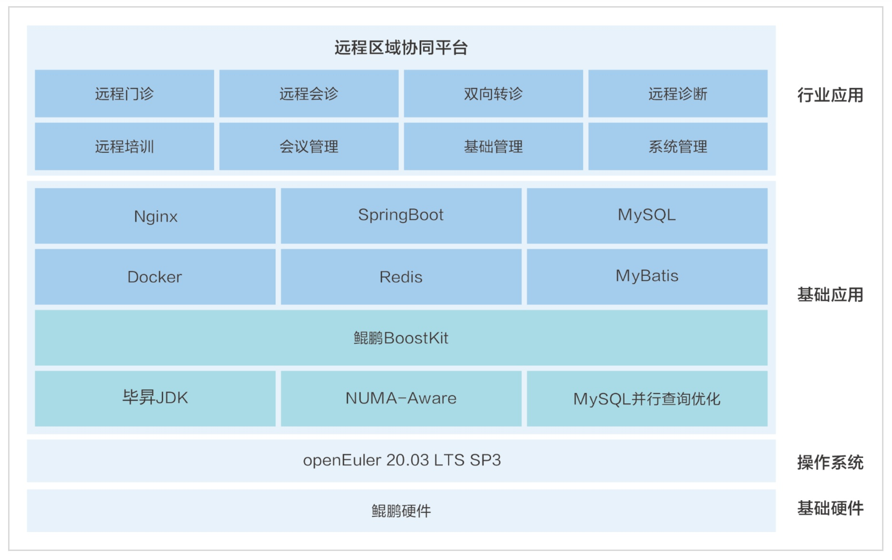

**应用场景**

随着医疗数字化转型的不断深入，远程医疗服务网络的建设和完善成为提升医疗服务效率和质量的关键。简实信息推出的远程区域协同平台，基于openEuler操作系统，致力于实现医疗服务的远程化、智能化和高效化。

**解决方案**

简实信息的远程区域协同平台解决方案包括：

-   **openEuler操作系统**：利用openEuler操作系统的稳定性和安全性，为平台提供了坚实的基础。

-   **性能优化**：通过openEuler操作系统的优化特性，结合毕昇JDK、MySQL细粒度优化和无锁优化技术，全面提升了平台的性能。

-   **快速响应**：基于鲲鹏底座的系统架构，能够快速响应业务需求变更，支持流程的快速变化和创新。

-   **用户友好的界面**：提供图形用户接口，采用现代浏览器软件风格，使用户易于掌握和使用。

> 

**客户价值**

-   **医疗服务网络完善**：通过远程区域协同平台，健全和完善了远程医疗服务网络，提高了医疗服务体系的宏观效率与服务质量。

-   **分级就诊模式促进**：平台促进了分级就诊模式的全面落实，优化了医疗资源的分配和利用。

-   **基层服务能力提升**：提高了基层医疗卫生服务机构的服务能力，使得患者能够享受到更高质量的医疗服务。

-   **兼容性与安全性**：系统具备强兼容性和安全性，能够适应不同规模和种类医院的需求，同时保障了系统的保密性。

**应用**

该平台已经在多家医疗机构如洛宁县人民医院、漯河市中心医院等得到应用，证明了其在提升医疗服务效率和质量方面的实际效果。通过这一案例，我们可以看到openEuler操作系统在支持医疗数字化转型和提升医疗服务水平中的重要作用。
