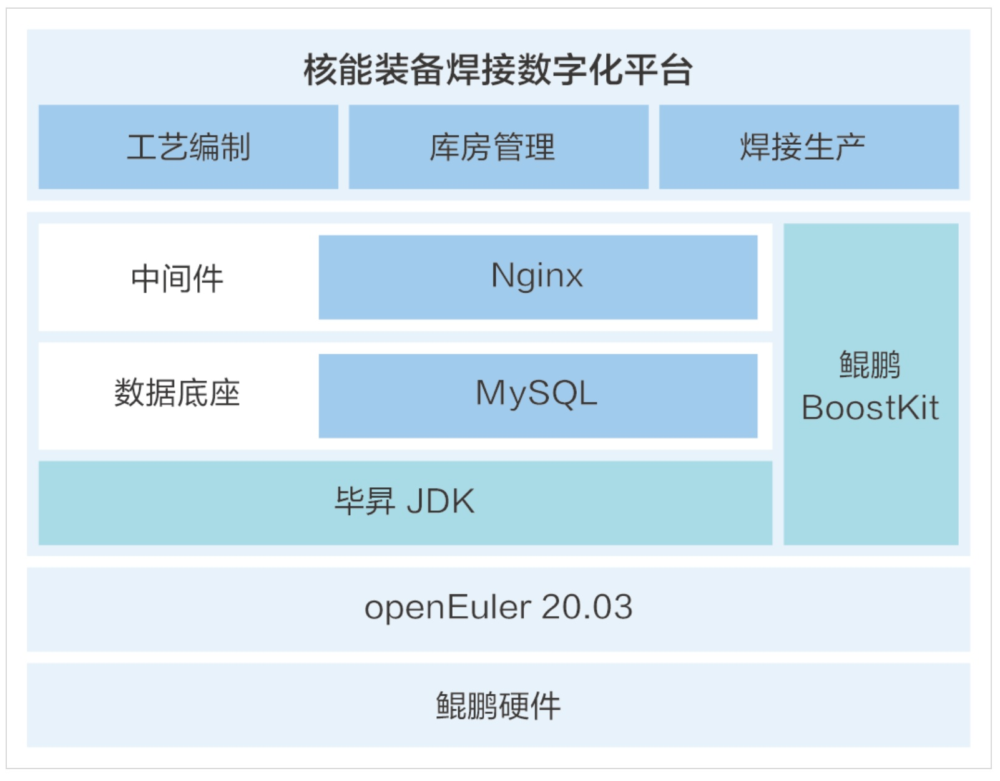

**应用场景**

在工业4.0时代，数字化转型成为制造业提升效率和质量的关键。兰石爱特工业互联网科技公司推出的核能装备焊接数字化平台，基于openEuler操作系统，实现了焊接全业务流程的数字化智慧管控。

**解决方案**

该焊接数字化平台的解决方案包括：

-   **工艺管理**：标准化管理焊接项目和焊缝任务，利用人工智能图像识别技术自动识别焊缝分布图，快速创建焊缝任务。

-   **生产过程管理**：实现生产在线排产，跨产品快速完成排产，实时在线跟踪反馈接收情况和变更进度。

-   **焊机群控和数据采集**：支持400+台焊接设备的群控和数据采集，通过网络实现实时在线监控和超规范自动报警。

-   **智能焊材库**：全流程管理焊材，基于三维可视化货位快速查询库存和材料位置，实现安全库存设置及预警。

**客户价值**

-   **性能提升**：部署在openEuler操作系统上的平台，通过鲲鹏应用使能套件BoostKit对数据库和操作系统进行调优，显著提升了性能。

-   **数据延迟减少**：与传统服务器相比，鲲鹏服务解析周期平均在4ms，提升了12.5%，在数据延迟和线程阻塞方面有显著提升。

-   **监控与优化**：通过对各层进行监控，逐层查找问题并进行定位分析，提升了系统稳定性和可靠性。

-   **事务处理能力增强**：调优后的TPS和QPS性能分别提升了22.5%和17.2%，增强了平台的事务处理能力。

**应用**

兰石爱特工业互联网科技公司的核能装备焊接数字化平台，通过结合openEuler操作系统的强大性能和稳定性，为用户提供了一个高效、智能的焊接工艺管理解决方案。该平台已经在兰石重装压力容器焊接数字化车间得到应用，证明了其在提升焊接质量和生产效率方面的实际效果。通过这一案例，我们可以看到openEuler操作系统在支持工业数字化转型和智能制造中的重要作用。
