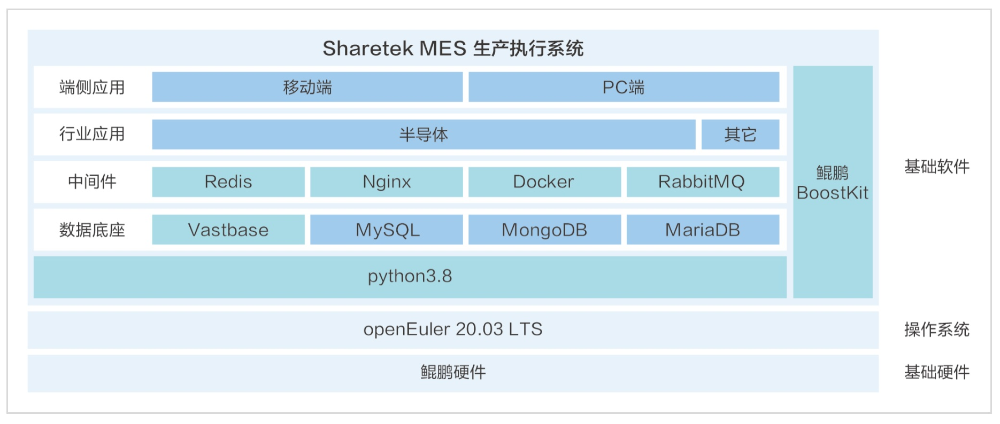

**应用场景**

在制造业数字化转型的浪潮中，企业迫切需要一套能够快速响应市场变化、适应不同生产环境的生产执行系统。轩田科技的Sharetek
MES生产执行系统，基于openEuler操作系统，为企业提供了一个符合ISA-95标准的企业级应用平台。

**解决方案**

轩田科技Sharetek MES系统的解决方案亮点：

-   **openEuler操作系统**：系统采用openEuler作为其操作系统，确保了系统的稳定性、安全性和可维护性。

-   **自主创新技术架构**：结合开源openGauss内核的Vastbase企业级关系数据库，系统具备高度的可靠性、可用性、可扩展性和可移植性。

-   **模型构建与快速部署**：能够根据客户行业特性和生产环境进行模型构建，快速搭建满足企业业务需求的内部系统。

-   **全链路数据打通**：系统能够实现从底层设备到上游系统的全链路数据集成，提高企业运营效率。

> {width="5.768055555555556in"
> height="2.448611111111111in"}

**客户价值**

-   **数字化转型支持**：帮助企业实现新形势下的数字化转型，满足未来系统可持续性发展要求。

-   **高端精密制造需求满足**：系统具备高度完整性和强大开放性，满足高端精密制造的高标准需求。

-   **运营效率提升**：通过全链路数据集成，大幅度提高企业的生产和运营效率。

-   **自主创新需求满足**：采用先进、自主创新的技术架构，支持企业的自主创新和持续发展。

**应用**

Sharetek
MES生产执行系统已经在半导体行业头部客户、新锐厂商和电科研究所等项目中得到成功应用，证明了其在支持企业数字化转型和提升运营效率方面的实际效果。
