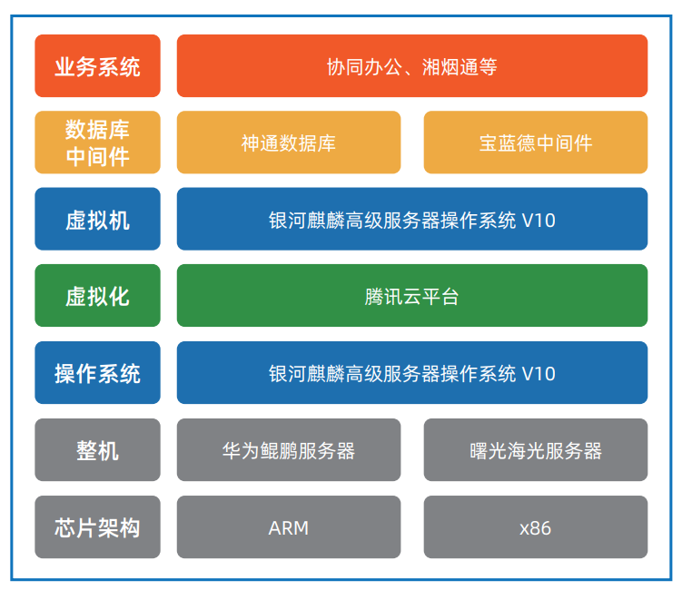

## 应用场景

为落实和响应网络设备改造的相关政策，湖南省烟草专卖局需对业务系统进行改造升级，以实现高可靠、高稳定和强安全的信 息化系统。客户需要在不降低性能要求的基础上对原有业务进行全栈改造，包括服务器、操作系统、数据库、中间件、业务系 统、个人电脑、办公软件等，提升业务系统的安全性、可靠性。

## 解决方案
 
 

项目全部基于银河麒麟操作系统 V10 为安全底座。为满足 某省烟草专卖局未来近万台终端的办公需求，麒麟软件跟 腾讯云、神通数据库、宝蓝德中间件、泛微 OA 等产品进 行了适配和优化，在功能和性能上满足了用户的业务需求。

## 客户价值

-	性能领先：该项目采用了银河麒麟操作系统 V10 为安全底座，采用飞腾和海光服务器和神通数据库、宝蓝德中间件，对平台的 性能优化，在业务迁移到新平台后，性能达到并在某些应用超过了原平台。
-	 稳定高效：银河麒麟操作系统在业务运行一年时间未出现任何事故，充分保障了烟草用户的业务运行和数据安全。

## 伙伴

