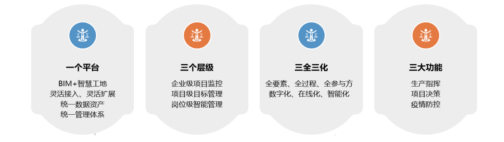

## 应用场景

智慧工地助力抗疫复工，为实现对现有智慧工地平台的改造要求，并满足试点部门日常办公并与抗疫复工的需要，运用智慧工地 产品整体解决方案能力，通过“AI 中台 + 边缘计算”的能力，对复工企业在原有生产指挥、项目决策的基础上，增加疫情防控 的功能，构建“建筑工地智慧大脑”，做到助力抗疫、复产两不误。 智慧工地的抗疫复工业务主要落实了各级政府疫情防控要求，发挥实名制系统的作用，对接省、市统计平台，建立健康台账，支持 各地健康码录入，体温测量和口罩识别。以四层三生、数据互通、平台为王，进行衍生智慧，产生数据，催生应用的逐层实现。

## 解决方案

誉托科技与中软国际合作完成了智能工地业务系统服务器从 CentOS 到欧拉开源操作系统的迁移。

- 保持原有 x86 浪潮物理服务器不变，操作系统采用 openEuler LTS 20.03 SP3。 
- 保持原有的 MySQL 数据库应用不变，完成对数据库数据的迁移。 
- 迁移过程中将原有数据库根据业务进行拆分，智慧工地与抗疫复工子模块拆封为 2 个独立的数据库，性能提升 30%。

-	项目全部基于银河麒麟操作系统 V10 为安全底座。为满足 某省烟草专卖局未来近万台终端的办公需求，麒麟软件跟 腾讯云、神通数据库、宝蓝德中间件、泛微 OA 等产品进 行了适配和优化，在功能和性能上满足了用户的业务需求。

## 客户价值
- 业务系统方面，在不进行代码改造的前提下，实现了应用和操作系统的无缝对接迁移，将原有业务都迁移到欧拉开源操作系统， 并保证正常运行。 • 初步建立安全可靠适配工作的配合流程，实现智慧工地全平台的升级改造要求，满足试点部门日常办公并与抗疫复工要求。 

- 通过本次业务系统成功迁移的过程为客户的全系统迁移输出方案提供了重要参考并为后续工作打下良好基础。

## 伙伴

