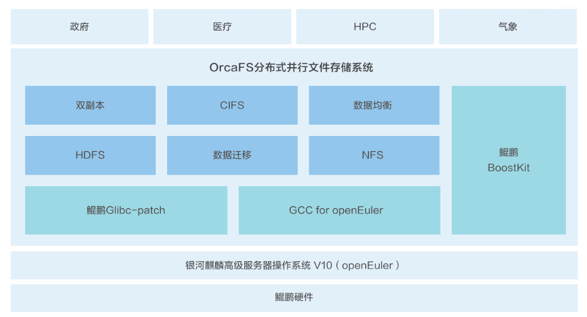

## 用户背景

西安奥卡云数据科技有限公司是一家以软件定义存储、智慧物联网为核心，双核并进，持续赋能企业数据管理及智能运维的高新技术企业。公司致力于为政府机关、军工、教育科研、医疗、智慧城市等多个领域打造融合、智能、高效、可靠的产品及相关解决方案。

## 方案介绍

OrcaFS分布式并行文件存储V3.0（简称“OrcaFS”）是一款面向高性能计算和大数据应用的存储产品，采用存储服务与元数据服务分离部署的方式，拥有独立的分布式文件系统缓存OrcaOND（OrcaFS On Demand）支持高效的突发缓存系统Burst Buffer，支持跨节点的副本和纠删技术，拥有快照、配额管理、域管理、在线升级等功能。
支持国产私有网络协议，同时支持POSIX、CIFS、NFS、FTP、FTPS、HTTP等网络共享协议，提供非结构化海量数据的存储功能，以集群文件系统和集群NAS方式向用户提供服务。

奥卡云数据的OrcaFS高性能计算解决方案基于鲲鹏基座，利用鲲鹏应用使能套件BoostKit、鲲鹏开发套件DevKit、openEuler、openGauss等进行全栈优化，使得OrcaFS更加适合高性能计算领域海量小文件和非对齐IO对低延时高IOPS的要求。 基于鲲鹏BoostKit调优后，4k随机读写性能分别提升45%和30%，4k顺序读写性能分别提升115%和34%，解决高性能计算带来的突发性IO浪涌问题。

## 方案架构图

## 优势亮点

• OrcaFS支持多客户端并行访问，确保应用获得更高的带宽；

• OrcaOND高效突发缓存系统，解决突发性IO浪涌问题，提高IOPS的同时，降低延时；

• OrcaFS提供副本、纠删、RAID等数据保护机制，其中RAID-M元RAID支持三重校验，保证三块硬盘同时故障，数据不丢失

## 伙伴

