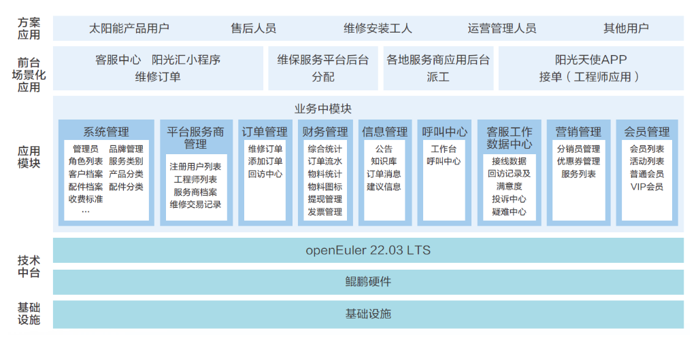

## 用户背景

山东力诺瑞特新能源有限公司位于中国山东济南力诺科技园内，创立于2001年。致力于新能源综合开发应用与系统解决方案提供，业务集太阳能热水、热能，空气源热泵等多能互补系统的研发、制造及综合应用于一体。

## 方案介绍

基于鲲鹏底座和openEuler开源操作系统驱动系统发挥极致性能，面向太阳能售后系统服务场景，结合鲲鹏硬件多核能力，为阳光天使SAIS系统提供了性能卓越的售后服务，满足集团及子公司的业务要求。 使能鲲鹏BoostKit，发挥MySQL无锁优化和细粒度锁优化的优势，提供一个可持续发展的基于鲲鹏底座的应用产品，实现产品自主创新要求。 借助鲲鹏多核、高并发的特点，对系统进行了测试、调优，目前系统运行顺畅高效；并借助鲲鹏DevKit各种工具对系统进行优化。结算管理性能提升34%

## 方案架构图

## 优势亮点

• 阳光天使SAIS系统是为公司自主研发的维保派工平台，依托鲲鹏硬件底座，对售后系统完成迁移和集成，升级完善各终端的应用功能，优化系统架构。

• 与部署在鲲鹏上的BI工具全面集成，分析服务订单执行、来电信息、去电回访等基于地图、区域、分类、时间、时长、满意度等的大数据分析应用。

• 订单流水是系统的核心业务，针对该场景，通过使用鲲鹏BoostKit、MySQL无锁优化和细粒度锁优化，使TPS性能测试指标提升17.72%，性能优异，满足生产要求。

## 伙伴

