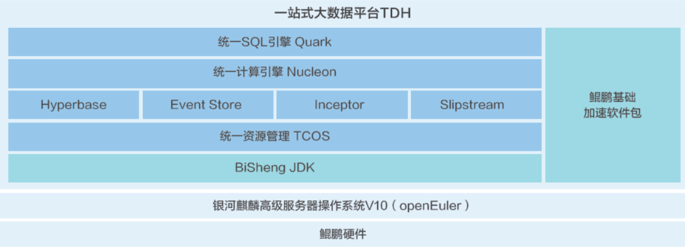

## 用户背景

星环科技致力于打造企业级大数据基础软件，围绕数据的集成、存储、治理、建模、分析、挖掘和流通等数据全生命周期提供基础软件与服务。

## 方案介绍

Transwarp Data Hub(TDH)是星环科技自主研发的企业级一站式数据管理平台，操作系统选用银河麒麟高级服务器操作系统V10(openEuler)。凭借星环科技创新的技术架构和深厚的产品研发能力，使TDH拥有创新多模型技术架构、统一数据管理、支持9种存储引擎、10种存储模型、存算解耦、统一SQL语句、超高性能等8大核心优势，帮助企业加速数字化转型，更全面、更便捷、更智能、更安全地运用数据，大幅降低综合成本。 通过鲲鹏多核架构的算力优势，利用TDH的存算解耦技术，构建的存算分离解决方案，拥有更灵活的技术架构，在处理分析PB级别海量数据时，计算性能提升25%，TCO成本降低36%。基于存算分离构建核心商业系统，是企业实现一站式数字化转型、加速业务创新的致胜关键。

##  方案架构图

## 优势亮点

- 统一多模、统一存储、自由架构、自主创新；

- 整体性能性能提升25%，TCO成本降低36%；

## 合作伙伴

