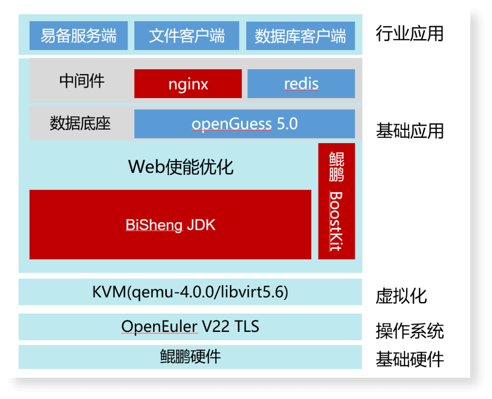
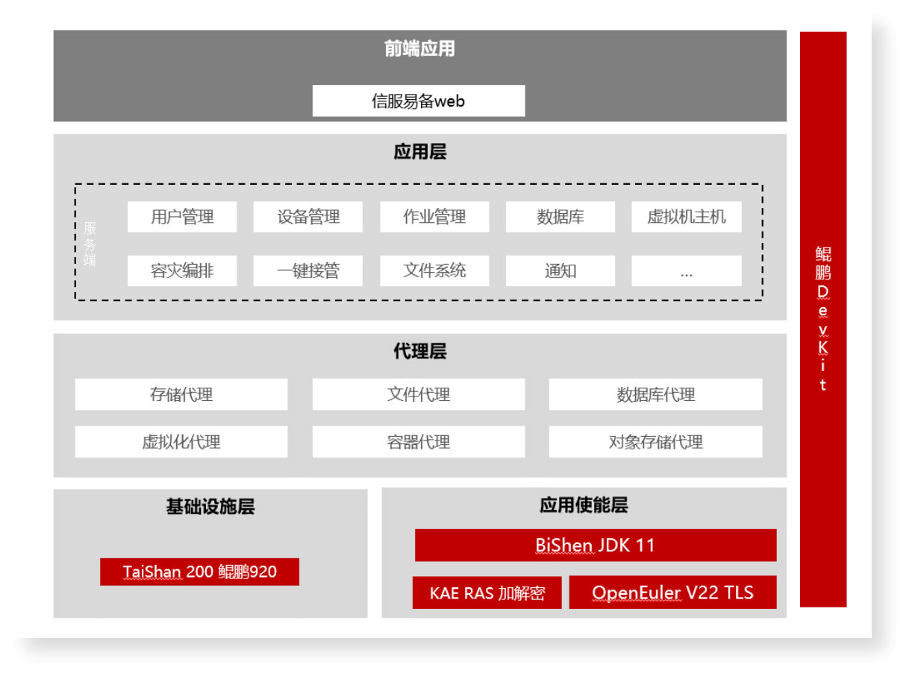

## 应用场景

武汉吧哒科技股份有限公司（简称：吧哒科技）成立于1999年1月，立足国内大数据安全保障产品和服务提供商的战略定位，专注数据安全与容灾备份，为云上云下提供全面数据安全保障。旗下核心产品——信服易备数据安全管理软件采用软硬件一体化配置与服务方案，实现数据库、文件、应用、虚拟机等数据的备份和恢复，对核心业务数据以实时同步方式进行持续保护，快速响应业务需求。

## 业务挑战

数据要素是数字经济发展的核心引擎，助力行业数字化转型，实现降本增效。而近年来由于数据系统遭受网络攻击、勒索病毒、自然灾害等的风险威胁也在持续升级，任何非计划性内的停机，都可能引发巨大的经济损失和社会影响，因此灾备建设的重要性不言而喻。

灾备建设是保护数据可用性的关键措施，然而我国数据灾备建设始终是数据安全中较为薄弱的一环，面临着多重挑战：

- 数据同步困难：数据同步时涵盖主机层、数据库层、存储层的复制，数据格式复杂、数据量大；

- 运维效率低：灾备系统涉及网络、应用切换、策略管理、容灾演练等多种技术，运维管理难度高。

## 解决方案

吧哒科技与鲲鹏基于鲲鹏软硬件平台与openEuler操作系统，共同打造信服易备鲲鹏灾备一体机，满足数据保护的管理、灾备行业和信息系统灾难恢复的需求。
基于鲲鹏920底座+openEuler+openGuess可信执行环境，提供数据保护管理能力。

使用鲲鹏应用使能套件BoostKit进行全栈优化，采用KAE加解密加速引擎、毕昇JDK、鲲鹏底座+openEuler等特性进行全面性能优化，提升SSL/TLS握手效率。

方案架构图

## 客户价值

信服易备数据安全管理软件借助于openEuler操作系统实现了整体性能的提升，对比与主流的x86环境下的 Centos 7.9这个版本，通过fio针对磁盘IO的测试结果，openEuler在磁盘顺序读方面的性能提升48.2%，随机写性能提升90.5%，混合读写方面提升12倍；在相同网络带宽和CPU核数的基础条件下，文件的备份传输openEuler比centos在带宽方面要快70.5%，CPU消耗方面openEuler是2.1%，而centos 是25.2%。

当前，信服易备数据安全管理软件V4.0已服务于医疗、金融、政府、教育、企业等行业超1000家用户，覆盖湖北、湖南、江西、河南、安徽、浙江六大省份，并成功入选国家级大数据试点示范项目，获得 “湖北省2022年工业软件优秀产品”等多项荣誉。
